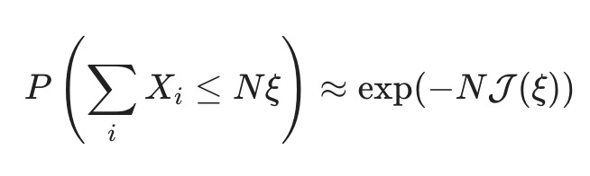
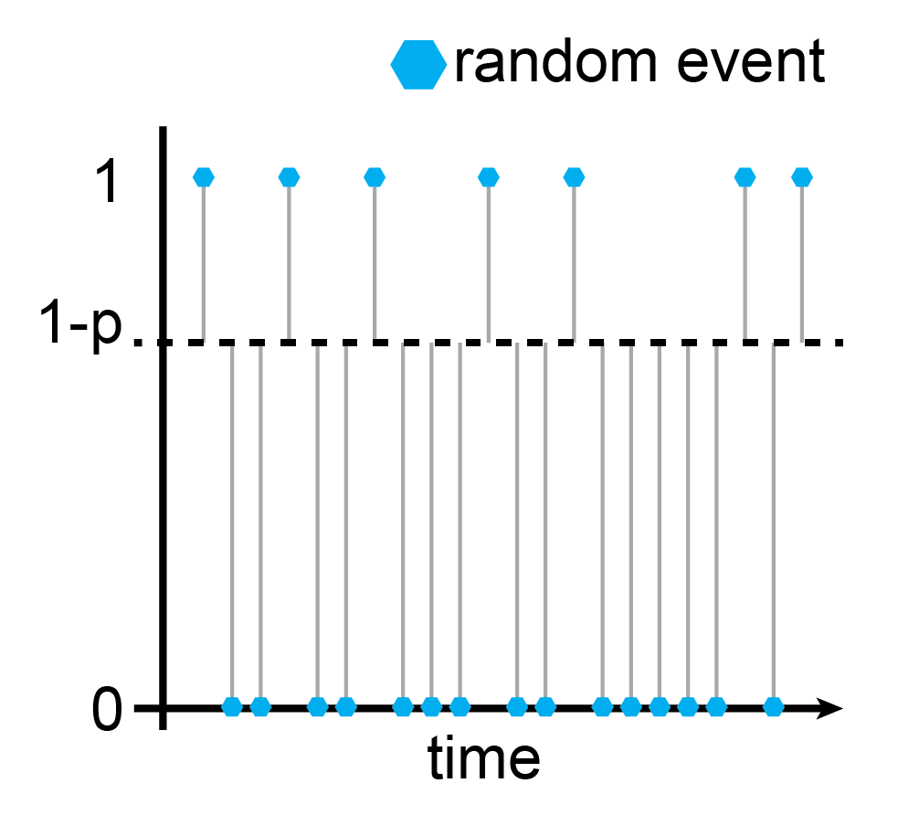
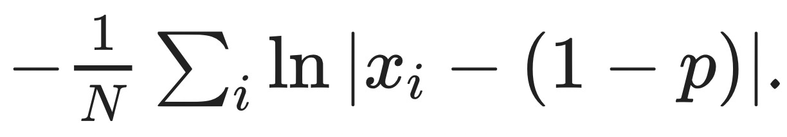
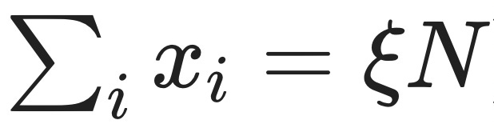
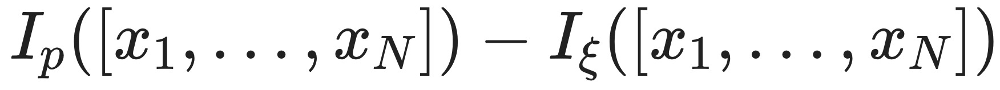
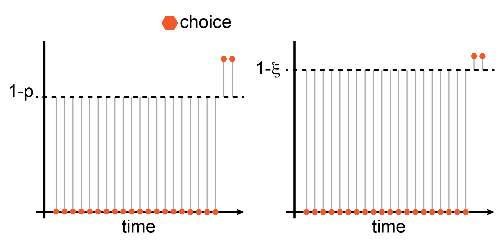
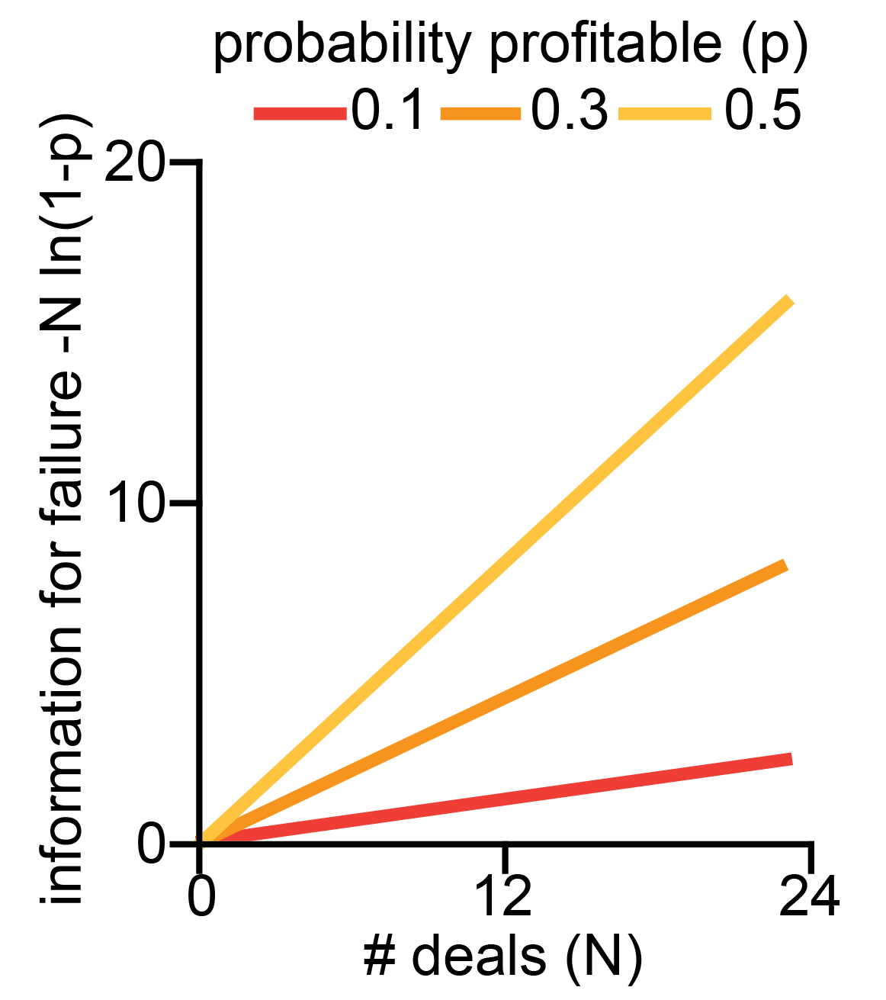
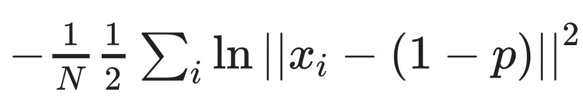

_Meta: After a fun little motivating section, this post goes pretty deep into the mathematical weeds - you might prefer to read it on[LessWrong](https://www.lesswrong.com/posts/KtCJNw93KHg7MSSvw/adversarial-attacks-and-optimal-control) with proper typesetting instead of my creative use of Unicode._

####  **TL;DR:**

  1. When we invest the appropriate effort, the probability of random catastrophic events tends to decrease exponentially with a rate given by the[^1] rate function.
  1. One way of estimating the rate function is to solve an optimal control problem, where we have to determine the "least surprising" way that the catastrophic event comes about. The rate function then equals the catastrophic event's surprise (in [nats](https://en.wikipedia.org/wiki/Nat_\(unit\))).
  1. Thus, intuitively, as we invest the effort to decrease the probability of random catastrophic events, the "difficulty" of performing an adversarial attack only increases linearly.

##  **Real talk and real estate**

Zillow is an American tech real-estate marketplace company that recently had (what the experts call) a small [snafu](https://en.wikipedia.org/wiki/SNAFU). They decided they were done _just_ being a marketplace and started [buying up homes, completing light renovations, and then selling them with a profit](https://www.businessinsider.com/ibuyer-defunct-why-did-zillow-stop-buying-houses-2021-11). The whole thing went poorly; they bought houses too expensive and had to sell at a loss, [costing the company $420 million and leading to large lay-offs](https://www.nytimes.com/2021/11/02/business/zillow-q3-earnings-home-flipping-ibuying.html).

This story is not very interesting[^2] for anyone who's not directly involved. The reason I remember the whole affair is a [Twitter thread](https://twitter.com/ESYudkowsky/status/1456279486840721414?s=20&t=kqTdW87iwMg3f9zhqYKQ_w) that also caught the attention of Eliezer:

The thread lays out how Zillow relied too much on their [automatic estimates](https://en.wikipedia.org/wiki/Zillow#Zestimate), which ([ex-ante](https://kirchner-jan.github.io/minimalprior/posts/universalprior/slightly-advanced-decision-theory?s=w#:~:text=is%20coming%20from.-,Diverse%20detours.,-On%20the%20topic)) looked good on average, but (ex-post) manifested in the worst possible way[^3]. Or, in the words of the OP:

> "[They mistook] an adversarial environment for a random one."

I have approximately zero knowledge about Zillow or the real estate business, so I can't comment on whether this actually is what went wrong. But the distinction between a **random** and an **adversarial** environment applies beyond the Zillow example and is relevant for research in AI Safety: from [adversarial examples](https://en.wikipedia.org/wiki/Adversarial_machine_learning), via [adversarial training](https://www.alignmentforum.org/posts/A9tJFJY7DsGTFKKkh/high-stakes-alignment-via-adversarial-training-redwood), all the way to conceivable [existential risk scenarios](https://en.wikipedia.org/wiki/AI_box). It is the distinction between a world where it's fine to go outside because [getting struck by lightning is sufficiently unlikely](https://www.cdc.gov/disasters/lightning/victimdata.html) and a world where [somebody is trying to smite you](https://unsongbook.com/chapter-3-on-a-cloud-i-saw-a-child/#:~:text=ACROSS%20ALL%20SEPHIROT.-,I%20THINK%20SOMEBODY%20BOILED%20A%20GOAT%20IN%20ITS%20MOTHER%E2%80%99S%20MILK.%20IT%20IS%20ALWAYS%20THAT.%20I%20KEEP%20TELLING%20PEOPLE%20NOT%20TO%20DO%20IT%2C%20BUT%20NOBODY%20LISTENS,-.%E2%80%9D).

This post works towards achieving a mathematical understanding of what distinguishes [these two worlds](https://people.wou.edu/~shawd/mediocristan--extremistan.html). Perhaps other people are not as confused about this point as I was, but hopefully, the arguments are still useful and/or interesting to some. I'll introduce a bit of [extreme value theory.](https://en.wikipedia.org/wiki/Extreme_value_theory) Then I'll demonstrate a neat connection to [control theory](https://en.wikipedia.org/wiki/Control_theory) via [large deviation theory](https://en.wikipedia.org/wiki/Large_deviations_theory), which shows that an exponentially decreasing risk of failure translates into a linearly increasing difficulty of adversarial attacks.

##  **A random environment**

I'll go over the basics quickly: When you (i.e. Zillow) think of your environment as random, each house you buy is essentially a coin flip with a biased coin. If you make sure that 

  1. the expected value of a deal is positive and 
  1. that all the deals are ([mostly)](https://en.wikipedia.org/wiki/Martingale_central_limit_theorem) independent of each other, 

then you're guaranteed to accrue profits _eventually_. 

An illustration of how a sequence of house buys will end up net positive if repeated sufficiently long.

This guarantee is the [law of large numbers](https://en.wikipedia.org/wiki/Law_of_large_numbers) from probability theory 101 and probably not too revolutionary for you, dear reader. But what is the probability of things going very badly? What is the probability of an [extreme event](https://en.wikipedia.org/wiki/Extreme_value_theory) or a [large deviation](https://en.wikipedia.org/wiki/Large_deviations_theory)? It should decrease (given the law of large numbers), but how _fast_ does it decrease?

Let's continue the example of buying and selling houses and say that there is a probability p that a given deal ends up profitable. The worst-case probability that _all_ your deals go poorly is (1−p)ᴺ, which goes to 0 exponentially fast as we increase the number of deals N.

It turns out that this toy example [generalizes a lot](https://en.wikipedia.org/wiki/Cram%C3%A9r%27s_theorem_%28large_deviations%29), and the probability that the sum of independent random variables Xᵢ is less than some fraction ξ times N ~~always~~[^4] goes down exponentially fast in N:

The function J(ξ) is called the "[rate function,](https://en.wikipedia.org/wiki/Rate_function)" and it determines the speed with which extreme events get unlikely.

How to compute the rate function[^5]? That is what we'll explore in the next section. There is a "[standard](https://en.wikipedia.org/wiki/Cram%C3%A9r%27s_theorem_\(large_deviations\))" way of calculating J(ξ), which is a bit involved and opaque[^6] for my taste; I prefer a slightly non-standard derivation[^7] of arriving at the rate function, which gives deeper insight into how adversarial attacks and extreme events relate.

##  **Average surprise and optimal control**

As I like to say: [there is, of course, another way of looking at this.](https://youtu.be/1bSPNboKCzM?t=966) We can think of the sequence of house deals as a sequence of random events that fluctuate around the probability of failure 1−p. 

For a truly random sequence of events, we can compute the **[average surprise](https://en.wikipedia.org/wiki/Entropy_\(information_theory\))** by averaging the information content of all events:

where the **[information content](https://en.wikipedia.org/wiki/Information_content)** of an individual event is given as

and the probability measure Pₚ(x) is a Bernoulli measure, Pₚ(x) = p when x is 1 and 1-p when x is 0. In the picture, the probability of a random Bernoulli event is the distance from the dashed line, Pₚ(ξ)=|ξ−(1−p)|. Consequently, the information content is Iₚ(ξ)=−ln|ξ−(1−p)|, and the average information content of the sequence is[^8]

Why am I bringing this up? [It turns out](https://en.wikipedia.org/wiki/Sanov%27s_theorem) that the rate function J(ξ) is the solution to [an optimal control problem](https://en.wikipedia.org/wiki/Freidlin%E2%80%93Wentzell_theorem) that involves the **average excess surprise**. In particular[^9],

The intuition behind this equation is: If we want to know the rate function for an extreme event, [x₁,…,xₙ], we get to pick how the extreme event comes about (that's the inf). The only thing we have to respect is that the extreme event _does,_ in fact, come about

And then we try to make it so that the [average excess surprise](https://en.wikipedia.org/wiki/Kullback%E2%80%93Leibler_divergence)

is as small as possible.

Let's see how this plays out in our house deal example. We want to determine the probability that the sum of independent random variables ξ is less than some success fraction ξ times N, 

i.e. that a certain fraction 1−ξ of our N house deals go badly.

Now _we_ pick how the extreme event, [x1,…,xₙ], comes about. I went ahead and already did that in the illustration. I picked it so that the first (1−ξ)N deals go wrong, and only the remaining ξN deals go fine. This satisfies the constraint that 

and (thanks to commutativity[^10]) the average excess surprise of this configuration is identical to all possible permutations. Therefore, this configuration's average excess surprise is already the infimum of all possible configurations that satisfy the constraint. Given the expression we wrote above for the average information content of a Bernoulli sequence, we can write the average excess surprise as

Since we know that the first ξN many xᵢ are equal to 1 and that the remaining (1-ξ)xᵢ are equal to 0, we can simplify the expression for J(ξ) by splitting up the sums and regrouping,

You might recognize this as the KL-divergence between two Bernoulli random variables, DKL(Ξ||X)=E(ΞlnΞX), one with success probability p, the other with success probability ξ. When we plug in the extreme event that _all_ the deals go poorly, ξ=0, the rate function reduces to J(ξ)=−ln(1−p), and the probability of this extreme event is

as it should be.

##  **An adversarial environment**

Quick recap: 

  1. When we find ourselves in a random environment, we can leverage the law of large numbers to push the probability of failure close to zero by trying sufficiently many times[^11], N.
  1. If we want to determine _how fast_ the probability of failure goes to zero, we can find that out by solving an optimal control problem where we need to determine the least surprising way failure might come about, J(ξ). 
  1. The probability of failure goes to zero exponentially fast, proportional to how surprised we would be and the number of tries, exp(−NJ(ξ)).

So far, so good, but... what is that sound in the distance[^12]?

As general as the theorems mentioned above are in terms of the underlying distributions[^13], they **centrally rely on the assumption that the environment is** _ **random**_. This was not the case for Zillow, where homeowners and real estate agencies selling houses had [additional information](https://en.wikipedia.org/wiki/Caveat_emptor) to systematically select bad deals for Zillow. Instead of pushing the risk of total failure strongly toward zero, Zillow only increasingly exposed itself to an adversary with more insight into the situation.

While the **probability of complete failure,** exp(−NJ(ξ)), **falls exponentially** , the **amount of surprise required to bring it about** , NJ(ξ), **scales linearly!** A few things of note:

  1. The unit of "surprise" is [nats](https://en.wikipedia.org/wiki/Nat_\(unit\)), a measure of information. This interpretation maps only weakly onto the house buying example (where one [bit](https://rdrr.io/cran/infotheo/man/natstobits.html#:~:text=Details,log2\(e\)%20%3D%201.442695.) of information might indicate whether a given deal is bad for Zillow). Still, it has a much more straightforward interpretation when we think about set-ups where [information passes through a single channel and can be arbitrarily constrained](https://en.wikipedia.org/wiki/AI_box).
  1. Similarly, we can interpret the expected excess surprise, 

, as a functional on a state space spanned by [x₁,…,xₙ]. The fact that we compute the infimum over this functional turns the problem into an instance of [Hamilton's principle](https://en.wikipedia.org/wiki/Hamilton%27s_principle) \- the "true" evolution of the sequence of states is stationary w.r.t. the "action" given by the excess surprise. Through this lens, we're close to "[intelligence as optimization power](https://www.alignmentforum.org/tag/really-powerful-optimization-process)", which characterizes intelligence as the ability to steer reality into a small subset of possible states. But I can't quite put the pieces in the right place to make the connection click.

  1. Since we compute NJ(ξ) as the solution to an optimal control problem that minimizes excess surprise, **it is the lower bound on the amount of surprise required**. Catastrophe can also come about in more surprising ways, but [highly improbable events tend to happen in the least improbable way](https://www.stat.cmu.edu/~cshalizi/754/2006/notes/lecture-30.pdf). On the plus side, catastrophe _cannot_ come about with less surprise, which might have applications for the [set-ups with constrained communication](https://en.wikipedia.org/wiki/AI_box) mentioned in point 1.
  1. The team at Redwood Research recently [released their report on their research on high-stakes alignment](https://www.alignmentforum.org/posts/A9tJFJY7DsGTFKKkh/high-stakes-alignment-via-adversarial-training-redwood#:~:text=With%20a%20conservative,rate%20of%20injuriousness\).), where they trained a filter to reduce the probability of harmful output from 2.5% in the training set to 0.003% after applying the filter to 0.002% after adversarial training. While OOM reduction in failure probability _feels_ comforting, this only helps when the adversary is not actively trying to trick the filter (from 3.6 nats to 10.8 nats of information). This is consistent with their finding that their tool-assisted search for adversarial examples was 1000x more effective than naive sampling.

These factors combined make me excited about exploring this direction further to find reliable estimates of the lower bound of input required to bring about catastrophe[^14]. I'm also curious if there is more structure to the similarity between the information content of an adversarial attack and the characterization of intelligence in terms of optimization processes. If you know more about this or can point me to some literature on the topic, please let me know!

[^1]:(appropriately named)

[^2]:How much is $420 million again? My gut feeling is that this type of snafu happens somewhere in the world every other week.

[^3]:In the same way that the maximum of a set of random variables [can be overwhelmingly good in expectation](https://kirchner-jan.github.io/minimalprior/posts/universalprior/slightly-advanced-decision-theory?s=w#:~:text=is%20coming%20from.-,Diverse%20detours.,-On%20the%20topic), the minimum of the same set is terrible (in expectation). That's the power of choice.

[^4]:Well, not always. That's the point of this post.

[^5]:you ask, presumably on the edge of your seat.

[^6]:(you need the logarithm of the [moment generating function](https://en.wikipedia.org/wiki/Moment-generating_function) of your random variable, λ(θ)=lnE(exp(θXi)), and then you need to compute the Legendre-Fenchel transformation, J(ξ)=supθ>0[θξ−λ(θ)].)

[^7]:I don't have a reference that follows the same path I choose, but I enjoy the texts by [Touchette 2011](https://arxiv.org/abs/1106.4146) and [Paninski 2006](https://www.google.com/search?q=paninski+large+deviation+optimal+control+leaky+integrate&oq=paninski+large+deviation+optimal+control+leaky+integrate&aqs=chrome..69i57j0i512l2j46i512j0i10i30j0i30j0i5i30l4.11018j0j4&sourceid=chrome&ie=UTF-8#:~:text=The%20most%20likely%20voltage%20path%20and%20large%20deviations,stat.columbia.edu%20%E2%80%BA%20pubs%20%E2%80%BA%20ml%2Dpath%2Djcns).

[^8]:Absolute values are a bit icky, but we can be sneaky since we have the logarithm and write 

instead. This expression now has an uncanny similarity to the [Freidlin-Wentzell](https://en.wikipedia.org/wiki/Freidlin%E2%80%93Wentzell_theorem) rate function, which can't be a coincidence.

[^9]:(I recommend staring at that for a while.)

[^10]:When the control problem gets more involved and the individual time points are not interchangeable, this step gets a bit trickier, and we have to recruit some [mathematical machinery](https://en.wikipedia.org/wiki/Euler%E2%80%93Lagrange_equation).

[^11]:Given that the expected value is positive, ofc.

[^12]:[source](http://www.blackswanman.com/#lg=1&slide=0)

[^13]:and any additional structure you might want to slap on

[^14]:Perhaps we can manage to stay below that bound reliably?
