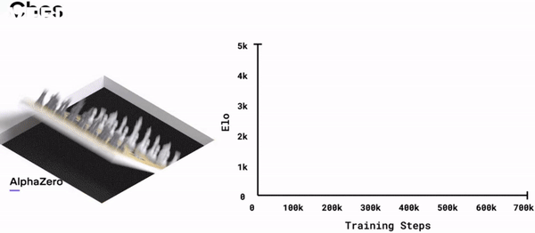
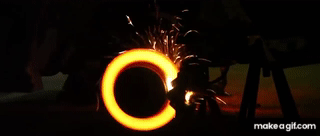

### Apologia

There is a story about John Nash that I like a lot. John Nash is a famous mathematician who got a (fake) Nobel prize for his work in game theory as well as a Hollywood adaptation starring Russell Crowe. But (if you trust his biography) his contribution to mathematics is at least as great. He had a very curious way of working:

> _Nash's main mode of picking up information he deemed necessary consisted of quizzing various faculty members and fellow students. \[...\] Some of his best ideas came "from things learned only halfway, sometimes even wrongly, and trying to reconstruct them - even if he could not do so completely._ (A Beautiful Mind, Sylvia Nasar, pg 68)

He started out with something very wrong, then went with his first (wrong) attempt at a solution to one of his colleagues, who helped make it slightly less wrong. Nash then repeated this procedure until, in the end, he had a working proof.

Apart from some hard questions about ownership (can Nash really claim that he produced the proof?) and the obvious issue that Nash turned very schizophrenic in his later years, I admire this way of working (at least for doing very hard research) and aspire to do the same. I really really want to get answers - and I don't care if I have to recruit help and produce a lot of nonsense on the way. This is, of course, just a poor fig leave of a defense for all the nonsense I am producing on this platform. Mea culpa.1

## Several perspectives on development

After building a digital person, writing love letters to albatrosses, philosophizing about scale in academia, and asking large language models pointed questions, it is time to write about something where I actually have institutional credentials, i.e. neuroscience and the development of the brain. Why is this an interesting topic?2 While traditionally brain development is a very biology-heavy topic, there are some beautiful results and ideas that generalize far beyond biology and become relevant for people working on artificial intelligence or computations in general. And those results are not widely known, especially not outside a small community in (computational) neuroscience. This essay is written with this in mind and I have tried to reduce jargon to a minimum.

The biology info in this post is focused on small mammals (mouse pups), which might feel like a limitation3. But then again, mice can do a lot more than you’d think. Exhibit 1 - skateboard mouse!

This is a _lot_ better than I do on a skateboard. I guess it helps to have all four limbs so close to the floor. source

## A “pretty pictures” perspective

I would not call myself a biologist by any stretch of the imagination - but I can get very excited about videos. _Seeing_ biology in action is very cool.

**Embryonic Day 1**: Here is a recording of a mouse embryo at the "two-cell stage".

The cell surface marker in green was only imaged for the final division from 32 to ~64 cells. It doesn’t just pop into existence. Strnad et al Nature Methods 2016

**Embryonic Day 6-8**: From there, things get out of hand quickly. Cells just _keep_ on dividing.

It's not super easy to see, but inside that ball of cells is a sheet of cells that folds into a tube (appropriately named the neural tube) that will eventually develop into the central nervous system (i.e. brain and spinal cord).

This clip is supposed to show the folding of the neural tube, but it's still kind of hard to see.

**Embryonic Day 11**: And then we're basically there. Just add a few tiny paws, mouth, eyes, tail, all the good stuff.

**Embryonic day 20/Postnatal day 1**: The mouse pup is born! But at that point, the pup is still “extremely-not-ready” for the world. "Day 1" here is the first day after birth.

Check out the full video on YouTube, it's worth it!

**Postnatal day 10**: While there is a lot happening "on the inside", not so much is showing on the outside. We still only have a pile of adorable mouse pups.

(The big hairy ones are actually female adult mothers, called "dams").

**Postnatal day 25**: But fast-forward 15 more days and it's like day and night - the mice (not pups anymore) are basically ready to go! Around postnatal day 14, they open their eyes, grow hair, and start running around.

There is still a lot more that happens after this stage (the brain keeps changing throughout the entire lifetime), but these first 2-3 weeks set up a _lot_ of the central nervous system.

It is great how _visual_ this part of biology is. I hope you found those videos as enjoyable as I did. It's very important to get a _feel_ for what you are talking about, otherwise, you might miss what's in plain sight. In the end, all models and theories cash out to a handful of cells or a pile of mouse pups. Everything is very _messy_.

## A molecular biology perspective

Okay, that’s what development looks like. How does it work? Let's zoom in a bit further. Those first cells in the clip at the top contain the entire genetic code. Can we understand that? How does it instruct the cells to divide like that and to form that ball and the pile of pups and do all the other things? Those are reasonable questions, right?

Well, take **this** as an answer:

The caption of this image contains the encouraging phrase "Interactions among these pathways are multiple and complex." This is also just the first example taken from Google, there are many many more diagrams like this and they all draw a lot of arrows in a lot of different directions. source

That's a lot to take in and if you make the mistake of asking an expert about it, you will learn 1000 interesting facts about "Bmi inhibition of p19" before lunchtime. Luckily I am not an expert on molecular biology, so I will give you just the most high-level explanation of how development happens on the molecular level:

> The behavior of a cell is determined by the proteins it expresses. The "central dogma" of molecular biology says that "DNA makes RNA, and RNA makes protein", so proteins come from the genes. Since we want a lot of different cells that do different things, we need cells with different proteins. "Signaling pathways" (like Sonic Hedgehog, Wnt, ErbB, IGF-IR, and Notch) can tell the cell which genes to express and, therefore, which protein to express. How does the brain know which signals to send to which cell? It just makes sure that different signalling molecules end up in different parts of the developing brain.

All of this is, like, _really_ complicated, but we4 are making good headway in improving our understanding. And perhaps there is hope that things will get easier to understand when we know more. Perhaps everything will just beautifully fall into place. But also perhaps not:

> There is no rule that says nature can not be more complex than our brains can handle. And after billions of years of evolution, why should it be simple?

Perhaps there are no shortcuts in explaining how the brain develops. Perhaps there are no simple sub-modules that can be carved out, studied in isolation, and reduced. That would be kind of annoying.

## A computational perspective

But explanations in terms of genes feel very unsatisfactory anyway. If I ask "How does a computer work?" it is not technically _wrong_ to give me an explanation of the chip-making procedure.5 But what I actually want to hear is an explanation of boolean circuits and perhaps a bit on the theory of computation. It's not actually very useful to understand exactly how a microprocessor works at the transistor level - but the theory of computation has legs in terms of what it can explain. So are there statements about brain development that are flavored a bit more like the theory of computation?

Despite the (somewhat fatalistic) arguments about the possible futility of understanding biology, there are also good reasons to believe that we _can_ get nice & simple answers. The implicit assumption that runs through the "gene-centered" perspective outlined in the previous section is that "the genes execute a (complicated) program that eventually produces a functional body+brain. To understand that process, we have to completely reverse-engineer the genetic program.” But as we have seen in the videos, a newly born mouse experiences a lot of development _after_ birth, at which point the animal is already exposed to its environment.

How exactly does that make it better? Doesn't that just make it... even more complicated? Indeed, the environment can be very hard to predict and quite perturbative: predators, conspecifics, seasons, losing an eye or a limb, the list goes on and on. It would be very hard to come up with individually tailored solutions to compensate for all of the possible perturbations. And weirdly enough that's a silver lining! In these situations, where the system is constantly perturbed and has to solve a lot of different problems, general solutions emerge (often). These general solutions tend to be not _too_ complicated and they tend to work well even outside the training domain.6 And they are one thing above all: robust to perturbations.7

## A dynamical system perspective

How do you get robustness? There is a standard answer from control theory that generalizes: Tightly coupled feedback loops. And indeed there is a very natural candidate for implementing such a loop: the reciprocal interaction of developing brain circuits and the activity they produce.

The little red triangles and the blue dots are neurons, of course.

The circuit is the network of neurons that emerges over development. And these neurons spontaneously produce action potentials and excite/inhibit each other8. The developing brain is highly active9!

Here is what the activity looks like in the developing retina, with cells that express a specific marker that produces light when the neurons are active:

The red color indicates "activity", i.e. those are cells in the retina that are firing. In this clip, you cannot actually see individual cell bodies, only the simultaneous activity of many hundreds/thousands of neurons. source

These patterns of activity are called "retinal waves" and they propagate from the retina to a central relay station and then finally into the visual cortex10:

The red color again indicates activity. Here the experimentalists managed to record activity from a central relay (SC = superior colliculus) and the visual cortex (V1 = primary visual cortex) simultaneously, so you can actually see how some of the activity in the bottom right translates into activity in the top left. Note that while most of the activity in the top left appears to be driven by the bottom right, there is also some “additional” activity (the very large event at the end) that doesn’t appear to come from the SC. source

But spontaneous activity is only half of the story:

The other half comes from the fact that the circuit organizes itself depending on the activity it experiences. In machine learning, this is the "gradient descent" that wiggles the parameters of the network to improve performance. In neuroscience, it might also be gradient descent, but it can also mean the formation or removal of connections.

The yellow dot marks where they are shooting a laser at the neuron to stimulate it. A few seconds later the neuron reaches out to form a new connection.

Exploring these rules for reshaping the brain is perhaps the most exciting thing we do at the lab where I do my Ph.D. The most famous principle is probably the Hebbian postulate (“Cells that fire together, wire together”), but there is a lot more nuance to be explored. Changes in the circuit depend on the exact timing of neural activity (on the scale of milliseconds), the type of cell experiencing the change, the location of the connection on the neuron, and is modulated depending on the context. But the big picture that emerges is that these changes coordinate to increase the computational capabilities, stability, and flexibility of the circuit.

Not only is the interaction between activity and plasticity goal-directed in the sense of making the circuit more capable. It is also very robust: f.e. if the animal loses an eye and thus receives less input to the brain, the brain will increase the amount of input from other sources until it again reaches the "correct" level. But what is the "correct" level? What is the goal of development?

## Development might be establishing a prior for predictive processing

A particularly powerful theory of how the mind works is the “predictive processing” theory.11 In this theory, the brain is constantly generating and updating a mental model of the environment. The model is used to generate predictions of sensory input that are compared to actual sensory input. This comparison results in prediction errors that are used to update and revise the mental model. Hence, the “goal” of the brain is to arrive at a mental model that is really good at predicting sensory input. And, in this view, the “goal of development” would be to prepare the brain as well as possible for predicting future sensory input. Development establishes “prior knowledge” that is useful for understanding the world.

There is a bit of evidence for something like this. Here are some of my favorites:

-   “Spontaneous cortical activity reveals hallmarks of an optimal internal model of the environment”
    
-   “Retinal waves prime visual motion detection by simulating future optic flow”
    
-   “Innate Visual Learning through Spontaneous Activity Patterns”
    
-   “Slow Feature Analysis on Retinal Waves Leads to V1 Complex Cells“
    

This is about as far as the field has come, i.e. this is the “state of the art”. This is a bit of a shame because it is _only just starting to get interesting_. I have so many more questions:

-   What can we say about this prior?
    
-   How much/what kind of information is contained in spontaneous activity?
    
-   Is this prior “just” for sensory and motor cortices, or might it also extend to higher cortical function?
    
-   Where does the prior come from (probably evolution, but when and can we identify changes over time)?
    
-   Under which circumstances is it possible to “bootstrap” a prior in this fashion (changes in circuit → changes in activity → changes in changes in circuit → …)?
    
-   How might a developmental prior relate to large pretrained/foundational models in ML?
    
-   Can we apply some of the techniques/vocabulary from the theory of computation to this domain?
    

If I ever get to have my own research lab, these are questions I would love to work on.

## In conclusion…

Condensed into a neat list of three points, what is my take on the development of the brain?

1.  Brain development is a protracted process that continues well after birth.
    
2.  After birth, the animal is exposed to a highly volatile environment that necessitates robust and general solutions.
    
3.  The reciprocal interaction between circuit organization and activation might robustly “bootstrap” prior information into the brain.
    

As mentioned above, point 3 is conjecture. But I’m very excited about that conjecture and if anyone has some leads or ideas (or questions), feel free to send me an email or to book some time for a chat with me :) Looking forward to talk!
