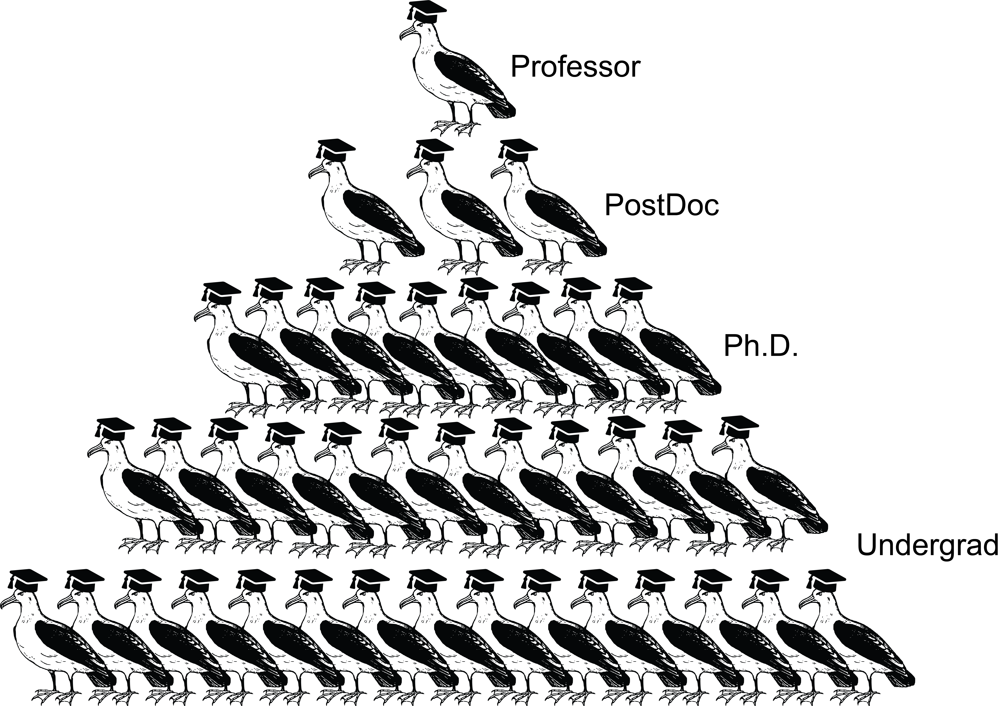
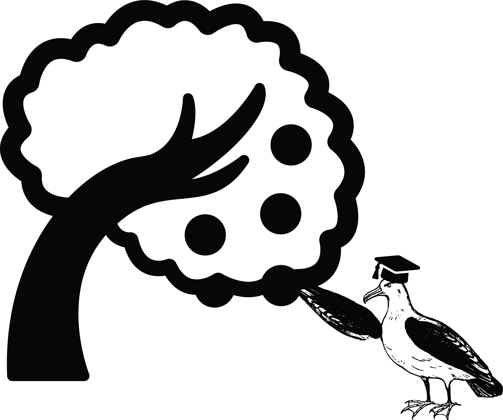
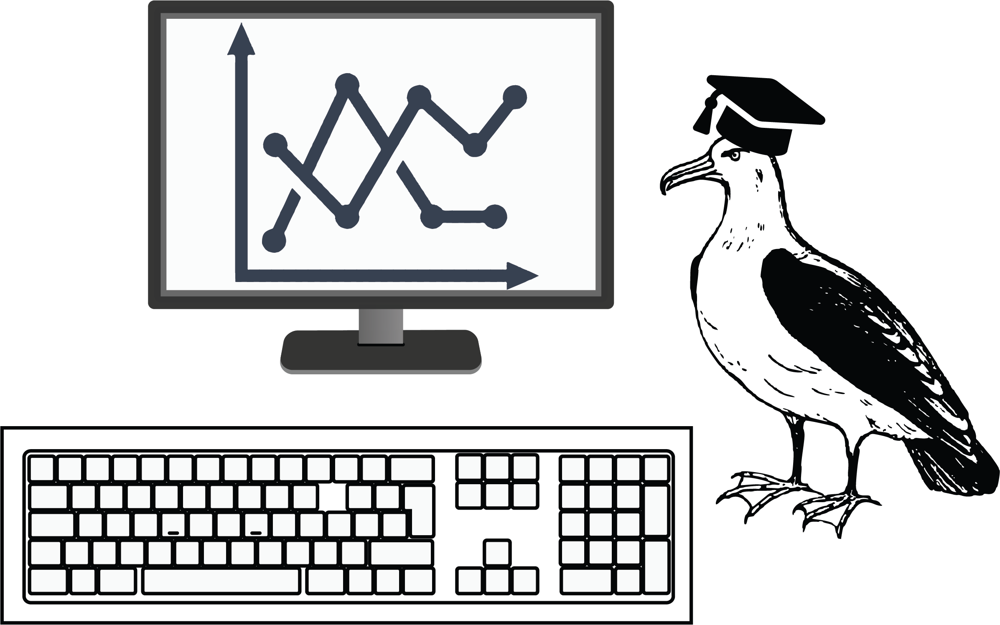
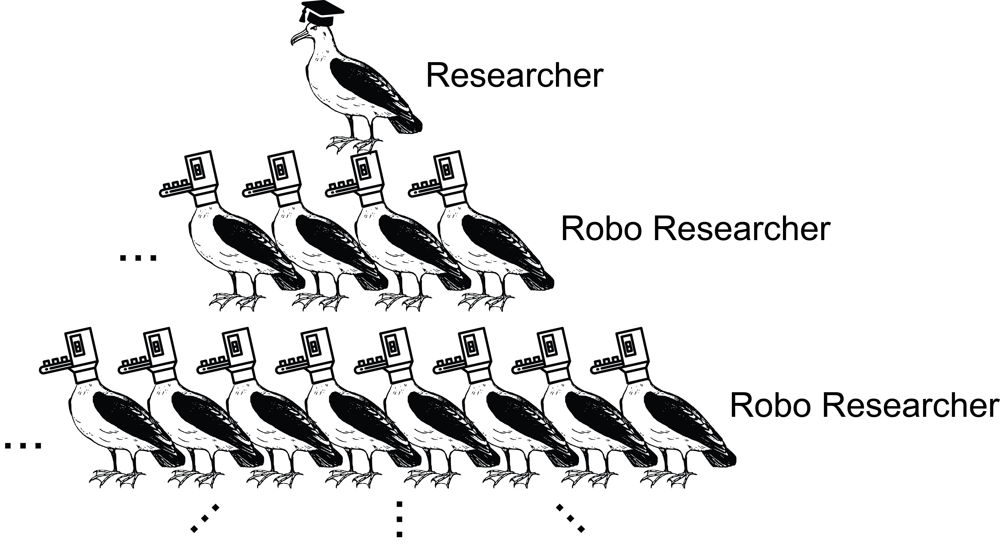
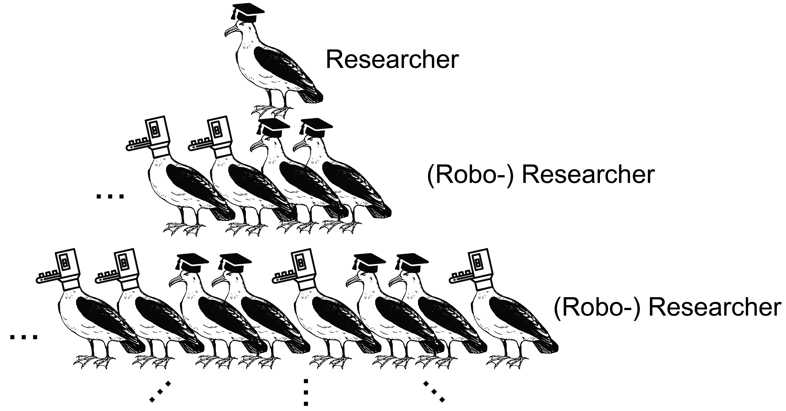
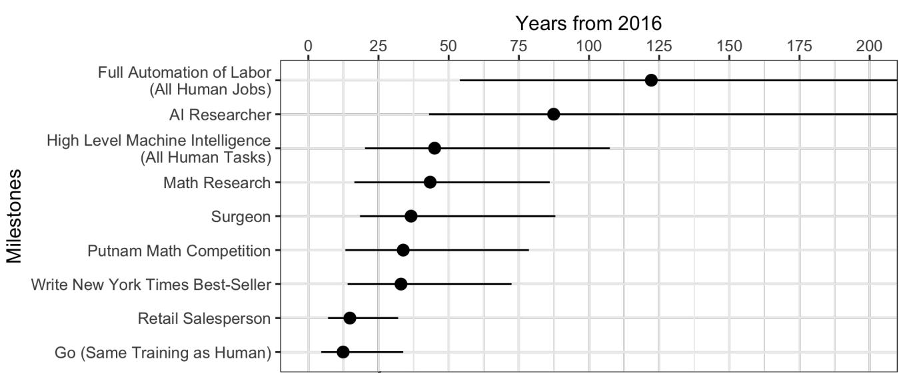

* * *

> _#[[[IAN says](https://universalprior.substack.com/p/making-of-ian):]] Here is a list of ideas for how to scale up academia:_
> 
>   1. Hire more people (who will be able to help you with your research if you have a good idea).
> 
>   2. Hire people who are good at doing things instead of people who are good at saying things.
> 
>   3. Use artificial intelligence (or get more people who know a lot about AI to help you).
> 
> 

 **epistemic status** : _I'm on the inside, so I feel I know a bit more than the median person. But still, very speculative and I'm mostly writing this to see where my logic fails._

* * *

## The potential impact of academic research

I have to admit, I kind of drank the [effective altruism](https://www.effectivealtruism.org/) cool-aid. I _do_ critically question all the assumptions and inferences of the community (and I don't agree with everything, not by a long shot[^1]), but the core principles are just too obviously good and true for me. This caused a good bit of distress for me since the other love of my life (academia) appears to be everything _but_ effective or altruistic.

So it was a surprise to read the very positive 80,000 Hours [career review](https://80000hours.org/career-reviews/academic-research/) on the (potentially) great impact of academic research. Here's part of the conclusion:

> A single outstanding researcher can move a field forward and make a significant contribution to solving key global problems. Beyond research, academics also have other avenues for impact, such as by influencing government policy, the priorities within their field, and the culture of society at large.

Now if that doesn’t sound encouraging! Examples of "outstanding researchers" with a huge altruistic impact that come to my mind are f.e. Norman Borlaug, whose discovery of the "[miracle wheat](https://en.wikipedia.org/wiki/Norman_Borlaug#Dwarfing)" prevented the starvation of [a billion people](https://twin-cities.umn.edu/news-events/man-who-saved-billion-lives)[^2]. Also, [Karikó and Weissman](https://www.nytimes.com/2021/04/08/health/coronavirus-mrna-kariko.html), whose research paved the way for the mRNA vaccines that have the potential to save lives from many more things than Covid-19. So, undoubtedly, there is potential for altruistic impact in academic research.

I still want to hedge my bets. If I’ll be an academic, I want to be an effective, altruistic academic. The logic is simple: If "more science = more good", we just need to get more science. Therefore, in this post, I’ll investigate some of the factors limiting academic research and think about how we work on these bottlenecks.

* * *

## Inadequate science

There are some pretty large research institutes: the Chinese Academy of Sciences employs 60.000 researchers, the French Centre National de la Recherche Scientifique employs 15.000 researchers and the German Max Planck Society employs around 7.500 researchers ([source](https://www.natureindex.com/news-blog/ten-global-institutions-universities-twenty-nineteen-annual-tables)). Those are not-small numbers, but they pale in comparison to employee numbers of Fortune 500 companies:

Leading 500 Fortune companies based on number of employees in 2019 ([source](https://www.statista.com/statistics/264671/top-50-companies-based-on-number-of-employees/)). I did _not_ expect the Deutsche Post on this list.

And the numbers from academia are also misleading: from experience, I can attest that the 7500 researchers of the Max Planck Society are, _at most_ , connected by some vague set of standards and values. In actuality, the society consists of a few hundred independent research groups, each with 5 to 100 researchers. And "independence" is really important here - anything like central coordination of research would be perceived as limiting scientific freedom[^3] and therefore bad. Why are 10-30 researchers the de-facto limit to how large a research group can grow? Why not thousands or tens of thousands?

Some differences between academia and the Fortune 500 are apparent immediately: Academic research requires highly trained labor and is constrained by whatever the funding bodies are willing to cough up in a given academic year. Walmart needs to provide much less training to their employees and their funding is self-generated, so we can expect scaling to be much easier here.

But there are also very strong amplification forces and accumulation of resources in academia. This is the famous "[Matthew effect](https://www.pnas.org/content/115/19/4887)", after the Dave Matthews band who tend to sell all the tickets in any city they play in[^4]. The well-funded get even more funding and those with little funding get pruned out. Why doesn't this dynamic "run away"? Why isn't literally _everyone_ a Ph.D. student of [Yoshua Bengio](https://nouvelles.umontreal.ca/en/article/2021/05/20/yoshua-bengio-ranked-2nd-in-the-world-by-guide2research/)?

Perhaps research questions are just not _deep enough_ to have 1000s of people working on them? I don't think this is true. Most researchers have very ambitious ideas and must contend themselves to work on small portions of those questions. The Manhatten Project, the Human Genome Project, and the LHC are prominent examples of such wide-ranging projects[^5]. _I_ could come up with a research program that keeps 1000s of people busy. Coming up with deep research questions is not the issue.

Might we conclude that we are already at some efficient frontier most of the time? Are we squeezing out the maximal efficiency with research groups with a median size of ten people? I have a couple of reasons to believe that this is not the case and that research output could be substantially increased.

* * *

## Hire more people?

>  _#[[IAN says:] ] An army of albatrosses walks into a bar:_
> 
> The albatrosses say, "We're here for the beer." The barkeep says, "Sorry, we're out of beer." 
> 
> The albatrosses say, "We'll take the spirits instead." The barkeep says, "Sorry, we're out of spirits."
> 
> The albatrosses say, "We'll have a couple of those red things." The barkeep says, "Those are the glasses you drink out of." 
> 
> The albatrosses say, "We'll have a dozen of those." The barkeep says, "Sorry, we're out of dozen—" 
> 
> The albatrosses say, "Shut up and pour!"

Let's go by the numbers first. The typical academic chain of command is very straightforward: 

The academic pecking order.

When we assume that (like in the schematic) at each level the supervision ratio is 1:2, we can [easily](https://jarednielsen.com/sum-consecutive-powers-2/) derive the average group size:
    
    
    Group size = 2^(3 + 1) - 1 = 15

Successful labs manage to scale this up by increasing the number of PostDocs or by introducing senior PostDocs/Group Leaders into the mix and by pushing how many students are supervised at each level:

#images-with-slightly-threatening-aura
    
    
    Group size = 3^4 - 1 = 80

Currently, this number does not scale. Approximately one hundred researchers appears to be around the maximum of how far a traditional research group can be stretched. Why is that? There appear to be two obvious ways to increase this number: adding more levels to the hierarchy and increasing the number of researchers supervised at each level. By the power of exponents, if we can add just one more level and increase the supervision ratio to 1:5, we would jump up to
    
    
    Group size = 5^5 - 1 = 3124

 _Now_ we're talking. Why are we not doing that?

(Obviously, there are more factors that influence scientific output beyond group size and a strict hierarchy is not the best way to structure things[^6]. But this objection [misses the point of scaling](https://www.gwern.net/Scaling-hypothesis#:~:text=capabilities.%20This%20year%2C-,GPT-3%20is%20scary,-because%20it%E2%80%99s%20a): Having something that _does_ scale, even if it looks stupid and over-simplified, beats something that doesn’t scale.)

* * *

##  **Adding more levels and increasing the supervision ratio**

>  _#[[IAN says:]] By the power of exponents I call upon_
> 
> Homer and his ilk; To mold us a new measure of delight, 
> 
> Something so exquisite and rare; That we shall sing aloud for joy. 
> 
> I am not Homer, am only a man; But I can put the words together in his power.

The natural limitation to “how deep you can make a hierarchy” is how efficiently you can propagate commands and reports up and down the chain. The natural limit to “how far you can increase the supervision ratio” is how many meetings you can squeeze into a week. [This](https://www.strangeloopcanon.com/p/meditations-on-regulations-quis-custodiet) post provides a great analysis of how the FDA might actually be operating at the maximum speed possible given its insane institutional design and absurdly overloaded responsibilities:

> Somewhere there are multiple leadership teams meeting who report to other leadership teams who report to the top, all of whom are trying to figure out what decisions should be made this week. And it's hard. Because if you have 10 projects ongoing and want to do a status update on all of them plus do review meetings, that's the week gone. Easily. Do this whole thing 10 times in parallel, and you could easily have an organisation of 1000s but where things take forever to move.

So the hierarchy cannot be scaled arbitrarily deep and broad, fair enough. But I have a hard time believing that academia is already maxing out its potential. Sure, every researcher at every level of the hierarchy will tell you that they are operating at the limit of what is humanly possible - but if you ask the same researcher which project management framework they are using, you get blank stares. Often, a new project is started by "just having the student read a bit" and then answering questions as they come up. If the stars align, a journal publication will pop out at the end of the process. Timelines are either non-existent or ridiculously poorly calibrated[^7]. At the same time, we are overloading the people at the top of the hierarchy (whose time is the most valuable resource of the entire system) with all the mundane tasks, paperwork, and emails. Adapting a page from "[Moloch's toolbox](https://equilibriabook.com/molochs-toolbox/#:~:text=Your%20translator%20wasn%E2%80%99t%20broken.)":

> In our world, "professors" are supposed to write grants, do teaching, oversee hiring, do public outreach, attend faculty meetings, supervise, write papers and (sometimes even) do research.

Getting a secretary, lab manager, or just someone who can help with illustrations[^8] is somehow perceived to be an optional luxury.

 **The proposed solution:** The answer is simple; _systematize_ and _delegate_. Create (and perfect) explicit workflows for short-term student internships, undergraduate theses, Ph.D. projects, long-running lab ambitions. Have explicit timelines with regular check-ins where you see if you hit your milestones or not. Have writing guides for papers[^9]. Set achievable, explicit goals (# of GitHub commits, # of entries in a group wiki, ...) and link career rewards to hitting these goals.

 **How to get there?** Perhaps the solution is not as easy as "[just start using agile](https://www.nature.com/articles/d41586-019-01184-9)". [This](https://brainbaking.com/post/2020/02/agile-academia/) post highlights the roadblocks the author ran into when trying to implement the agile framework in a traditional academic context. But the reasons for his failure can be summarized as: “traditional academia is not flexible enough to give project management frameworks a fair shot. It just doesn't compute with the academic mindset.”

I'm not satisfied with that answer. Systematizing has worked well for me in my research and I've been able to increase the number of projects I'm managing by maintaining explicit timelines (and torching projects that consistently run behind schedule). It is called the scientific _method_ for a reason. There are great workflows and frameworks that can be applied in almost arbitrary contexts. And the tools that support researchers are becoming better and more numerous every month (see [IAN](https://universalprior.substack.com/p/making-of-ian) and the like). The time is ripe for truly ambitious scaling of research and new institutions like [New Science](https://newscience.org/) have the potential to be the catalyzer for much of this progress.

* * *

###  **Possibility of low hanging fruit and lack of objective metrics**

>  _#[[IAN says:]] Here is a classic proverb about low-hanging fruit:_ Eat the seeds you planted, not the fruit that ripened.

He _can_ fly, he just _decides_ not to.

What would it mean for academia to be "efficient"? I like [this definition from economics](https://www.etf.com/sections/features/123.html) illustrated by the joke about the economist who won’t pick up the 20$ bill lying on a busy street because " _if it was real, somebody else would have already picked it up_ ". In academia, this translates to the statement "there is no low-hanging fruit": If you think you made an exciting new discovery after investing only little effort, you should be wary. Most likely, you are either wrong or somebody else already made this discovery and published it in the 1960s.

Physics is one subfield of science that appears to be "efficient" in this sense. If you _think_ you have built a Perpetuum mobile, [you are probably wrong](https://en.wikipedia.org/wiki/History_of_perpetual_motion_machines). The same goes for mathematics, where amateur "proofs" of ancient theorems _always_[^10] [turn out to be wrong](https://www.laphamsquarterly.org/roundtable/beware-cranks). Famously, Edmund Landau received so many incorrect amateur proofs that he prepared a form letter saying " _Dear Sir or Madam: Your proof of Fermat's Last Theorem has been received. The first mistake is on page _ line __." so that he'd only have to fill in the page and the line.

But it is wrong to conclude that every subfield of science is efficient. In 1880, observing a squirrel swimming across a river gave you a good shot at getting [published in Nature](https://www.nature.com/articles/023485b0). "[The developmental psychology of linguistics could've been discovered in the eighteenth century, in principle, but no one had even thought to look until the twentieth.](https://www.hpmor.com/chapter/6#:~:text=The%20developmental%20psychology%20of%20linguistics%20could%27ve%20been%20discovered%20in%20the%20eighteenth%20century%2C%20in%20principle%2C%20but%20no%20one%20had%20even%20thought%20to%20look%20until%20the%20twentieth)" Beyond a few "funny" (by academic standards) [ridiculously short journal papers](https://paperpile.com/blog/shortest-papers/), there are also [extremely](https://library.princeton.edu/special-collections/sites/default/files/Non-Cooperative_Games_Nash.pdf) [short](https://einsteinpapers.press.princeton.edu/vol2-doc/220) [Ph.D.](https://www.jstor.org/stable/44438182) theses from excellent researchers. And when physics was still "young", people like [Newton](https://en.wikipedia.org/wiki/Isaac_Newton) or [Euler](https://en.wikipedia.org/wiki/Leonhard_Euler) singlehandedly made _all_ the exciting discoveries.

Physics and mathematics are not young disciplines anymore, but Neuroscience, Cognitive Science, and Machine Learning are. Could it be that there are tons of "low-hanging fruit" that nobody is able to pick? I'm [not the first](https://equilibriabook.com/an-equilibrium-of-no-free-energy/#:~:text=To%20see%20how%20an%20inadequate%20equilibrium%20might%20arise%2C%20let%E2%80%99s%20start%20by%20focusing%20on%20one%20tiny%20subfactor%20of%20the%20human%20system%2C%20namely%20academic%20research.) to argue that academia might be inefficient in this sense - the gist here is the mismatch between "what funders value" and "what would be great for humanity". All the low-hanging fruit in the quadrant "not valued by funders, but still great for humanity" will not get picked.

Beyond this general argument, we are lacking objective metrics to evaluate what constitutes a "great scientific result". As a substitute, a lot of scientists use the proxy "time spent on a project" to evaluate the "quality of a project". This has been internalized to the point where I have seen many colleagues discarding the straightforward and fast solution (i.e. the low-hanging fruit) in favor of a more complicated and time-intense solution. Again, I'm not the first to observe academia's unhealthy relationship with simple solutions: Andrew Ng [received a surprising amount of pushback](https://soundcloud.com/theeconomist/gamechangers-more-than-just-a#t=21:40) when suggesting that GPUs could be used in computer vision because this was somehow perceived as cheating.

Once objective metrics are adopted ([like in protein folding](https://www.nature.com/articles/s41586-021-03819-2)), great scientific results will be acknowledged even when they come from "newcomers" and the results are derived in a much shorter time than the "time=quality" proxy would suggest.

 **The proposed solution:** If we accept that better metrics are (part of) what is missing for scaling science, there is one prominent candidate that is the "golden boy" of the rationality community: [prediction markets](https://www.investopedia.com/terms/p/prediction-market.asp).

> The prediction market is a market where people can trade contracts that pay based on the outcomes of unknown future events. The market prices generated from these contracts can be understood as a kind of collective prediction among market participants. These prices are based on the individual expectations and willingness of investors to put their money on the line for those expectations.

Am I taking this too far? No? Okay, then I’ll just keep going.

In my ideal world, we would establish prediction markets for _everything_. This would solve so many problems:

  * First and foremost, we would get a computerized representation of expert knowledge/uncertainty about the state of the art in all areas of science. This [opens the door](https://github.com/oughtinc/ergo/) to quantitative reasoning about so many things.

  * It would provide a numerical estimate of how "difficult" a question was perceived to be before it was answered. For example, [Metaculus asks](https://www.metaculus.com/questions/4034/by-2030-will-c-elegans-be-uploaded-to-the-satisfaction-of-top-computational-neuroscientists/) "By 2030, will C. elegans be uploaded to the satisfaction of top computational neuroscientists?" The community converged on (through, at the time of writing, 159 predictions) a 40% probability. If a research team manages to upload C. elegans by 2025, that would be a huge deal and the scientific community would have a harder time trivializing it.

  * Academics specializing in an esoteric topic currently [might struggle to find a job](https://en.wikipedia.org/wiki/Graduate_unemployment#:~:text=degree%202.94%25%5B15%5D-,College%20major%20by%20underemployment%20rate,-%5Bedit%5D), even though their expertise is certainly valuable. It's just that no single company needs a monopoly on that knowledge as much as it wants to not pay an additional salary. A scientific prediction market would allow the Ph.D. with niche expertise to systematically beat the market on a few questions and earn a living wage that way - while simultaneously increasing the power of the prediction market.

  * It is [well documented](https://fantasticanachronism.com/2020/09/11/whats-wrong-with-social-science-and-how-to-fix-it/) that markets are great at predicting whether a study will replicate or not. By leaning into prediction markets, we might be able to get out of the current horrible system where the quality of a study is a rough function of the impact factor of the journal, the prestige of the group, and the visual appeal of the figures; and instead, evaluate a study based on the solidity of the results.

 **How to get there?** This is a coordination problem and I have little hope that all of academia (part of which really likes the current system of subjective metrics) will adopt prediction markets because of this post (although they totally should).

However, not all of academia _has to_ switch. While "glory" and "funding" for picking low-hanging fruit might only follow once the larger part of academia adopts better metrics, you still get to keep the low-hanging fruit regardless. If only one discipline (Machine Learning, Cognitive Science?) or even just one sub-community (EAs? Rationalists?) can be convinced to adopt objective metrics, they can already reap the benefits.

Setting up an academic prediction market that is technically well-done and fun to use could do a lot of good. Perhaps [Metaculus](https://www.metaculus.com/questions/) is already exactly that platform[^11]. Alternatively, one could start a new scientific journal that has a prediction market for replication probability embedded for each paper? To reach a critical mass of scientific submissions, the journal could focus on publishing undergraduate or master theses in the beginning (which can be of surprisingly high quality). Finally, every academic reading this can do their part by calling their colleagues out on their bad predictions. This ties in with the previous section's point about calibrated timelines.

* * *

## Better tools, better science

Please don’t think that I was intentionally burying the lede. I do believe that 

  1. systematizing scientific work (collecting and refining explicit workflows)
  1. improving metrics of scientific progress (through f.e. prediction markets)

would be genuinely awesome things for academia at large. If I ever get to have my own lab, those two components will be high on my list of priorities. But it also turns out that those two components would go a long way towards automating research. I’m thinking a lot about how I could replace my students with Robo Researchers[^12]:

#images-with-explicitly-threatening-aura

… Okay, that came out wrong. What I actually mean is that I’m thinking a lot about how I could augment my research with Robo Researchers:

🎶 We learn to live, when we learn to give, Each other what we need to survive, together alive 🎶

My motivation for thinking about Robo Researchers is exactly the same as the motivation for accepting to supervise students in the first place: A day only has 24 hours and there is so much to do and it’s awesome to have someone help you. And let’s face it: a lot of the “stuff-that-needs-doing” is just grunt work. A typical task for a student of mine is “Can you run those simulations again but with different values of θ and put the results on slides?” or “Can you read up on the effect of the Fragile X mutation on SST interneurons in early development and write me a brief summary?“. If we could get a Robo Researcher to assist with that, that would be a big win for everyone involved. And with a software suite composed of something like [Codex](https://openai.com/blog/openai-codex/), a [fine-tuned language model](https://universalprior.substack.com/p/making-of-ian), and [Ought’s Elicit](https://elicit.org/) I think I am not too far away from making that a reality.

## Conclusion

While systematizing and introducing better metrics promise marginal improvements to research output, automation has the potential to be transformative. A [lot](https://web.stanford.edu/~chadj/IdeaPF.pdf) [has been](https://slatestarcodex.com/2018/11/26/is-science-slowing-down-2/) [said](https://marginalrevolution.com/marginalrevolution/2019/11/is-the-rate-of-scientific-progress-slowing-down.html) on the question of whether scientific progress is slowing down, but an equal amount [has](https://moores.samaltman.com/) [been](https://www.cold-takes.com/are-we-trending-toward-transformative-ai-how-would-we-know/) [said](https://twitter.com/balajis/status/1181830195260657664?lang=en) on how technology accelerates everything it touches. And it [does not take a huge stretch of the imagination](https://www.cold-takes.com/transformative-ai-timelines-part-1-of-4-what-kind-of-ai/) to see this trend reach research in due time. The consequences are hard to forecast and it’s a difficult question of whether it’s a desirable thing or not. Does “more research = more good” actually hold if we push to the extremes?[^13] I’m on the fence about this.

Different point. [Grace et al.](https://arxiv.org/pdf/1705.08807.pdf) performed an influential survey among machine learning experts about their timelines for when certain tasks can be accomplished by AI at the same level as humans:

Timeline of Median Estimates (with 50% intervals) for AI Achieving Human Performance.

But I think this provides a false sense of job security for researchers. Here are some reasons why it might take a lot less than 45 years before (f.e.) a [math researcher starts feeling the impact of AI](https://www.nature.com/articles/d41586-021-01627-2): 

  * AI doesn’t have to reach human-level for being _useful_ and _impactful_ in academic research. 

  * The amount of grunt-work in academia is underappreciated and automating it away is very much in reach.

  * A good bit of academia does not require performing experiments in the physical world but resembles software engineering - which is on the verge of becoming more automated.

  * AI researchers have no idea about the typical workflows of a surgeon or of publishing an NYT bestseller. They _do_ have a lot of insight into the typical workflow of a researcher.

I have a hard time figuring out what to make of this. One rather obvious conclusion for me is that I should not expect the near future in academia to look a lot like the last ten years. Putting myself in a position where I have the tools to pick low-hanging fruit as soon as it becomes feasible also sounds smart. Making sure that not everything goes terribly wrong? Not so sure how to tackle that one yet. Stay tuned.

* * *

 _Once again, big “thank you” to Nadia Mir-Montazeri for extremely useful feedback on this post!_

[^1]:And I will voice my concerns loudly on this Substack in due time.

[^2]:Although some say much less, the exact number is disputed.

[^3]:The situation at the CAS is probably different, see f.e. the [Pioneer Initiative](https://academic.oup.com/nsr/article/1/4/618/1515931). If anybody has more insight on how much research "on the ground" is centrally coordinated, I'd be interested to hear about it!

[^4]:Okay, okay. “ _For to every one who has will more be given, and he will have abundance; but from him who has not, even what he has will be taken away.”_ — Matthew 25:29, RSV. 

[^5]:And their respective successes and failures are highly instructive.

[^6]:[This](https://forum.effectivealtruism.org/posts/dCjz5mgQdiv57wWGz/ingredients-for-creating-disruptive-research-teams) extremely thorough and well-written EA Forum post seeks to identify the key factors that make some research teams more effective than others.

[^7]:Timelines being poorly calibrated is of course the standard _everywhere_. But academics should really know better, or at least start learning not to trust their gut feeling at some point.

[^8]:Guess where I learned to make pretty illustrations of albatrosses?

[^9]:Which are not passed on in ancient scrolls .docx files from senior PostDocs to PhDs, but instead are stored in a central repository.

[^10]:[Exceptions](https://slatestarcodex.com/2015/01/31/the-parable-of-the-talents/#:~:text=Consider%20for%20a,the%20unsolveable%20ones.) prove the rule.

[^11]:Although "real" financial incentives (rather than internet points) are obviously necessary to make this a viable source of income for experts.

[^12]:If you’re reading this: no offense, y’all are great.

[^13]:Once I’ve thought about it more this will be another post.
