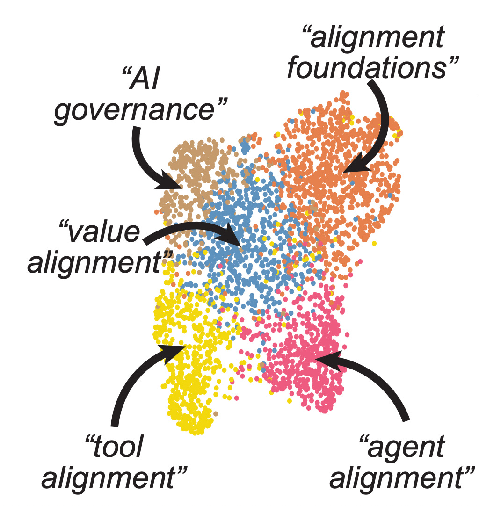
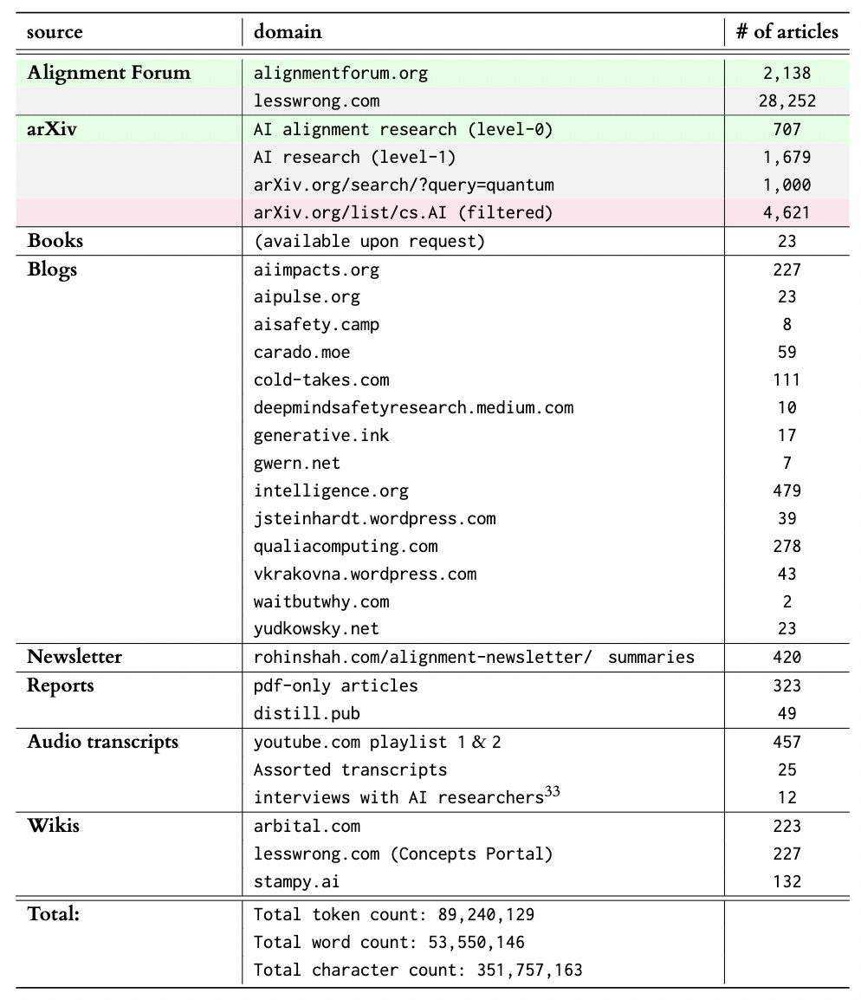
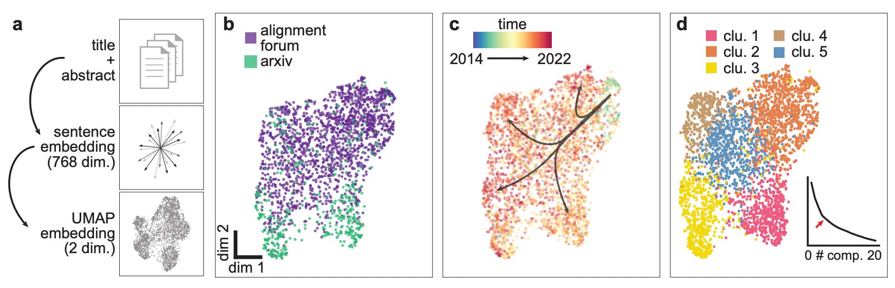
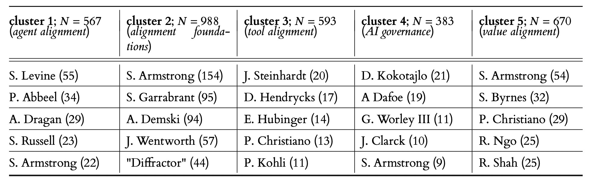
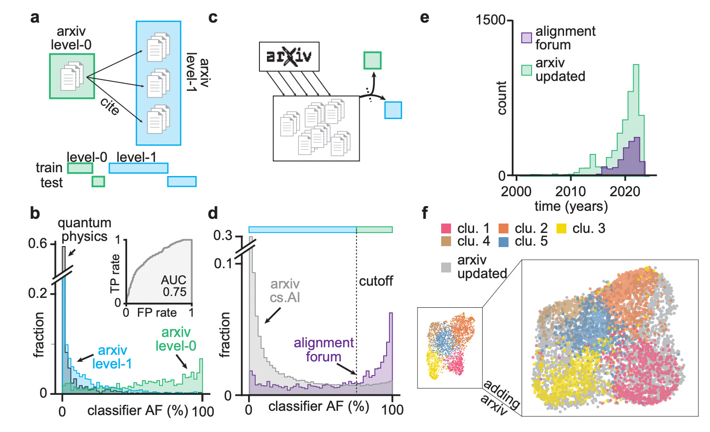

_Meta-meta: You can also find this[here](https://www.alignmentforum.org/posts/FgjcHiWvADgsocE34/a-descriptive-not-prescriptive-overview-of-current-ai) on the Alignment Forum._

 _Meta: In this project, we collected and cataloged AI alignment research literature and analyzed the resulting dataset in an unbiased way to identify major research directions. We found that the field is growing quickly, with several subfields emerging in parallel. We looked at the subfields and identified the prominent researchers, recurring topics, and different modes of communication in each. Furthermore, we found that a classifier trained on AI alignment research articles can detect relevant articles that we did not originally include in the dataset._

## Dataset Announcement

In the context of the [6th AISC](https://aisafety.camp/), we collected a dataset of alignment research articles from a variety of different sources. This dataset is now available for download [here](https://the-eye.eu/public/AI/Alignment/moirage_alignment-research-dataset/) and the code for reproducing the scrape is on GitHub [here](https://github.com/moirage/alignment-research-dataset)[^1]. When using the dataset, please cite our manuscript as described in the footnote[^2].

Table 1: **Different sources of text included in the dataset alongside the number of articles per source.** Color of row indicates that data was analyzed as AI alignment research articles (green) or baseline (gray), or that the articles were added to the dataset as a result of the analysis in Fig. 4 (purple). Definition of level-0 and level-1 articles in Fig. 4c. For details about our collection procedure see the Methods section.

Here follows an abbreviated version of the [full manuscript](https://arxiv.org/abs/2206.02841), which contains additional analysis and discussion.

## Rapid growth of AI Alignment research from 2012 to 2022 across two platforms

After collecting the dataset, we analyzed the two largest non-redundant sources of articles, Alignment Forum (AF) and arXiv. We found rapid growth in publications on the AF (Fig. 1a) and a long-tailed distribution of articles per researcher (Fig. 1b) and researchers per article (Fig. 1c). We were surprised to find a _decrease_ in publications on the arXiv in recent years, but identified the cause for the decrease as spurious and fixed the issue in the published dataset (details in Fig. 4).

Figure 1: **Alignment Research across a community forum and a preprint server.** ( **a** ) Number of articles published as a function of time on the alignment forum (AF; purple) and the arXiv preprint server (arXiv; green). ( **b** ) Histogram of the number of articles per researcher published on either AF or arXiv. Inset shows names of six researchers with more than 60 articles. Note the logarithmic y-axis. ( **c** ) Histogram of the number of researchers per article on AF (purple) and arXiv (green). Note the logarithmic y-axis.

## Unsupervised decomposition of AI Alignment research into distinct clusters

Given access to this unique dataset, we were curious to see if we could identify distinct clusters of research. We mapped the title + abstract of each article into vector form using the [Allen Institute for AI's SPECTER model](https://github.com/allenai/specter) and reduced the dimensionality of the embedding with UMAP (Fig. 2a). The resulting manifold shows a continuum of AF posts and arXiv articles (Fig. 2b) and a temporal gradient from the top right to the bottom left (Fig. 2c). Using k-means and the [elbow method](https://en.wikipedia.org/wiki/Elbow_method_\(clustering\)#:~:text=In%20cluster%20analysis%2C%20the%20elbow,number%20of%20clusters%20to%20use.), we obtain five clusters of research articles that map onto distinct regions of the UMAP projection (Fig. 2d).

Figure 2: **Dimensionality reduction and unsupervised clustering of alignment research.** ( **a** ) Schematic of the embedding and dimensionality reduction. After concatenating title and abstract of articles, we embed the resulting string with the Allen SPECTER model40, and then perform UMAP dimensionality reduction with n_neighbors=250. ( **b** ) UMAP embedding of articles with color indicating the source (AF, purple; arXiv, green). ( **c** ) UMAP embedding of articles with color indicating date of publication. Arrows superimposed to indicate direction of temporal evolution. ( **d** ) UMAP embedding of articles with color indicating cluster membership as determined with k-means (k=5). Inset shows sum of residuals as a function of clusters k, with an arrow highlighting the chosen number of clusters.

We were curious to see if the five clusters identified by k-means map onto existing distinctions in the field. When identifying the most prolific authors in each cluster, we noticed strong differences[^3] ([consistent with previous work](https://kirchner-jan.github.io/minimalprior/posts/universalprior/on-context-and-people?s=w) that suggests that author identity is an important indicator of research direction).

Table 2: **Researchers with the highest number of articles per cluster.** Clusters as determined in Fig. 2, with number of articles per cluster 𝑁. Number in brackets behind researcher name indicates number of articles published by that researcher. Note: "Diffractor" is an undisclosed pseudonym.

By skimming articles in each cluster and given the typical research published by the authors, we suggest the following putative descriptions of each cluster:

  1.  **cluster one** : _Agent alignment_ is concerned with the problem of aligning agentic systems, i.e. those where an AI performs actions in an environment and is typically trained via reinforcement learning.
  1.  **cluster two** : _Alignment foundations_ research is concerned with _deconfusion_ research, i.e. the task of establishing formal and robust conceptual foundations for current and future AI Alignment research.
  1.  **cluster three** : _Tool alignment_ is concerned with the problem of aligning non-agentic (tool) systems, i.e. those where an AI transforms a given input into an output. The current, prototypical example of tool AIs is the "large language model".
  1.  **cluster four** : _AI governance_ is concerned with how humanity can best navigate the transition to advanced AI systems. This includes focusing on the political, economic, military, governance, and ethical dimensions.
  1.  **cluster five** : _Value alignment_ is concerned with understanding and extracting human preferences and designing methods that stop AI systems from acting against these preferences.

We note that **these descriptions are chosen to be descriptive, not prescriptive**. Our approach has the advantage of being (comparatively[^4]) unbiased and can therefore serve as a baseline against which other (more prescriptive) descriptions of the landscape can be compared ([Krakovna's paradigms](https://vkrakovna.wordpress.com/2022/06/02/paradigms-of-ai-alignment-components-and-enablers/), [FLI landscape](https://futureoflife.org/landscape/), [Christiano's landscape](https://www.youtube.com/watch?v=-vsYtevJ2bc&ab_channel=CentreforEffectiveAltruism), [Nanda's overview](https://www.lesswrong.com/posts/SQ9cZtfrzDJmw9A2m/my-overview-of-the-ai-alignment-landscape-a-bird-s-eye-view), ...). Discrepancies between these descriptions and ours can serve as important information for funding agencies (to identify neglected areas) and AI Governance researchers (for early identification of natural categories for regulation).

## Research dynamics vary across the identified clusters

We further note some properties of the identified clusters (Fig. 3a). The cluster labeled as "alignment foundations" contains most of the seminal work in the field (Fig. 3b,c), but remains largely disconnected from the more applied "agent alignment" and "tool alignment" research (Fig. 3a). Furthermore, most "alignment foundations" work is published on the Alignment Forum (Fig. 3d) and it has the largest inequality in terms of "number of articles per researcher" (Fig. 3e). This corroborates an observation that [was made before](https://www.alignmentforum.org/posts/CpvyhFy9WvCNsifkY/discussion-with-eliezer-yudkowsky-on-agi-interventions#:~:text=Eliezer%20Yudkowsky-,Very%20grim,-.%20I%20think%20that): **While critically important, alignment foundations research appears to be poorly integrated into more applied alignment research, and the research remains insular and pushed by comparatively few researchers**.

Figure 3: **Characteristics of research clusters corroborate potential usefulness of decomposition.** (a) UMAP embedding of articles with color indicating cluster membership as in Fig. 2d. Labels assigned to each cluster are putative descriptions of a common research focus across articles in the cluster. (b) Number of articles published per year, colored by cluster membership. (c) Fraction of articles published by cluster membership as a function of time. (d) Fraction of articles from AF or arXiv as a function of cluster membership. (e) GINI inequality coefficient of articles per researcher as a function of article cluster membership.

## Leveraging dataset to train an AI alignment research classifier

After having identified the five clusters, we returned to the issue we noted at the onset of our analysis: the apparent decrease in publications on the arXiv in recent years (Fig. 1a). We were skeptical about this and hypothesized that our data collection might have missed relevant recent articles[^5]. Therefore, we trained a logistic regression classifier to distinguish alignment articles (level-0) from articles cited by alignment articles (level-1) (Fig.4 a). The resulting classifier achieved good performance and generalized well to papers from unrelated sources (Fig. 4b). We then scraped all the articles from the arXiv cs.AI category and asked our classifier to score them (Fig. 4c,d). Based on the distribution of scores of Alignment Forum posts (Fig. 4d) and after skimming the relevant articles, we chose a threshold of 75% as a reasonable trade-off between false positives and false negatives.

When adding the arXiv articles above the cutoff to our dataset, we observed a rapid increase in publications also on the arXiv (Fig. 4e). To test if our clustering is robust to this increase, we repeated the UMAP projection with the updated dataset and found that, indeed, the clusters are still in distinct regions of the manifold (Fig. 4f). Interestingly, the added literature appears to fill some of the gaps between "alignment foundations" and "agent alignment" research.

Figure 4: **An AI alignment research classifier for filtering new publications.** (a) Top: Illustration of arXiv level-0 articles (alignment research; green) and level-1 articles (cited by alignment research articles; blue). Bottom: Schematic of test-train split (20%-80% for training of a logistic regression classifier. (b) Fraction of articles as a function of classifier score for arXiv level-0 (green), level-1 (blue), and arXiv articles on quantum physics (grey). (c) Illustration of procedure for filtering arXiv articles. After querying articles from the cs.AI section of arXiv, the logistic regression classifier assigns a score between 0 and 1. (d) Fraction of articles as a function of classifier score for articles from the cs.AI section of arXiv (grey) and AF (purple). Dashed line indicates cutoff for classifying articles as arXiv level-0 (75%). (e) Number of articles published as a function of time on AF (purple) and arXiv (green), according to the cutoff in panel d. (f) Left inset: Original UMAP embedding from Fig. 2d. Right: UMAP embedding of all original articles and updated arXiv articles with color indicating cluster membership as in Fig. 2d or that the article is filtered from the arXiv (gray).

## Closing remarks

The primary output from our project is the curated dataset of alignment research articles. We hope the dataset might serve as the basis for

  * a semantic search service that returns relevant literature (see prototype [here](https://share.streamlit.io/kirchner-jan/search-engine/app.py)).

  * [writing assistants in the form of fine-tuned large-language models](https://www.alignmentforum.org/posts/ebYiodG3MAEqskCDG/a-survey-of-tool-use-and-workflows-in-alignment-research-1).

  * [projects to preserve AI Safety research in case of catastrophic events](https://www.lesswrong.com/posts/xrxh3usuoYMckkKom/preserving-and-continuing-alignment-research-through-a).

If you have other ideas for how to use the dataset, please don't hesitate to reach out to us; we're excited to help.

Furthermore, we hope that the secondary outcome from our project (the analysis in this post) can aid both funding agencies and new researchers entering the field to orient themselves and contextualize the research. 

As we plan to continue this line of research, we are happy about any and all feedback on the dataset and the analysis, as well as hints and pointers about things we might have missed.

 _Acknowledgments: We thank Daniel Clothiaux for help with writing the code and extracting articles. We thank Remmelt Ellen, Adam Shimi, and Arush Tagade for feedback on the research. We thank Chu Chen, Ömer Faruk Şen, Hey, Nihal Mohan Moodbidri, and Trinity Smith for cleaning the audio transcripts._

[^1]:We will make some finishing touches on the repository over the next few weeks after this post is published.

[^2]:Kirchner, J. H., Smith, L., Thibodeau, J., McDonnell, K., and Reynolds, L. "Understanding AI alignment research: A Systematic Analysis." _arXiv preprint arXiv:2206.02841_ (2022).

[^3]:Except for Stuart Armstrong, who publishes prolifically across all clusters.

[^4]:Remaining biases include: 

  * differences in formatting between arxiv and AF articles that bias the embedding

  * some (important) topics might not have any documentation due to infohazards

  * by implicitly focusing on number of published articles (rather than f.e. the "volume occupied in semantic space") we bias our analysis in favor of questions that can be written about more easily

[^5]:We took the [TAI Safety Bibliographic Database](https://www.alignmentforum.org/posts/4DegbDJJiMX2b3EKm/tai-safety-bibliographic-database) from early 2020 as a starting point and manually added relevant articles from other existing bibliographies or based on our judgment. We were very conservative in this step, as we wanted to make sure that our dataset includes as few false positives as possible.
