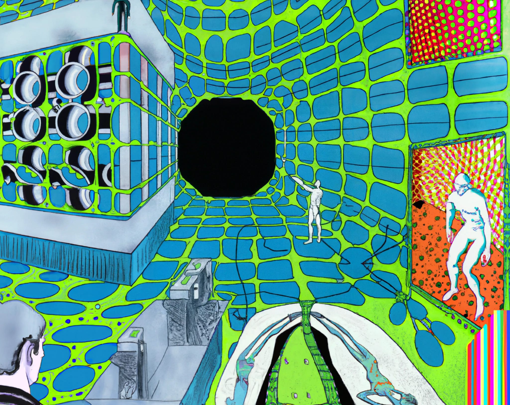
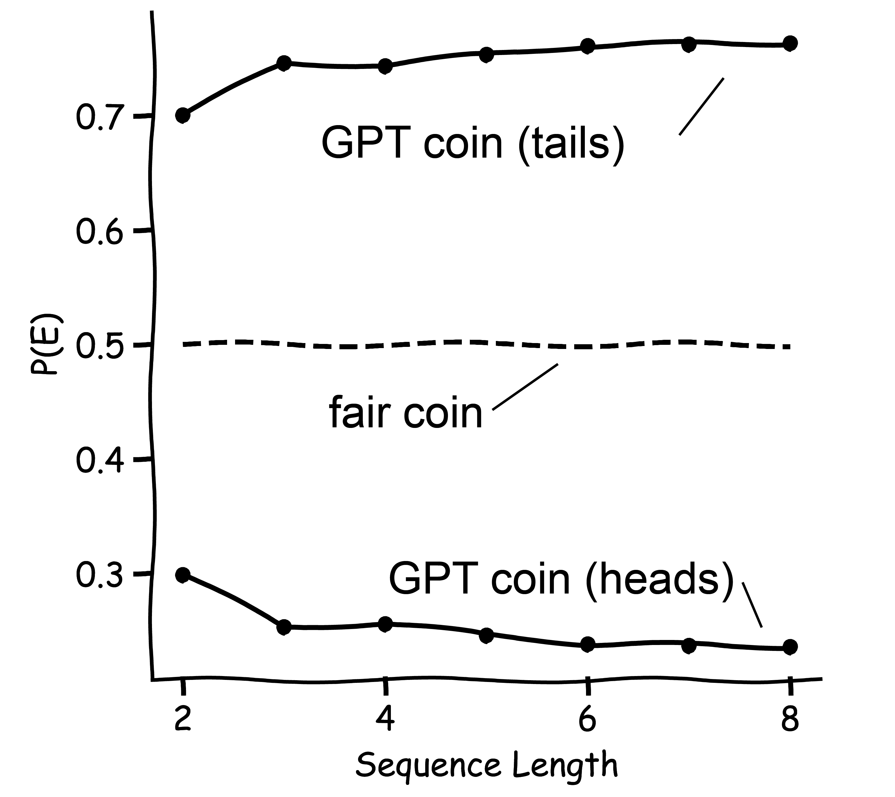
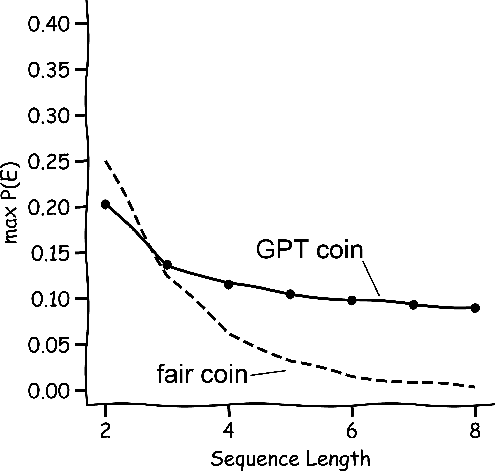

## Nerding out with the OG cyborgs

A few months ago, the [enigmatic](https://twitter.com/repligate/status/1609712964705157123?s=20&t=nd8IRj_AuWyqZ4NsToSQTQ) [janus](https://generative.ink/prophecies/) published a write-up on what they call "[simulator theory](https://www.alignmentforum.org/posts/vJFdjigzmcXMhNTsx/simulators)" on the Alignment Forum. The post spurred a lot of discussions and changed a bunch of minds. This outcome was not completely clear from the onset - janus has been a fixture in the alignment community and [on Discord](https://www.eleuther.ai/), and their thought has been [in the water](https://astralcodexten.substack.com/p/janus-gpt-wrangling) for a while. And the message of the simulator post is comparatively simple - “large language models can/should be viewed as simulators”. But the post ended up being a big success; it turns out that having janus’ philosophy laid out in writing enabled a lot more structured discussion than what would have been possible otherwise.

One of the structured discussions that were enabled by the post was a seminar series that I got to participate in over the last few months. [Our motivation](https://www.alignmentforum.org/posts/nmMorGE4MS4txzr8q/simulators-seminar-sequence-1-background-and-shared) for having the seminar was that simulator theory (in its current form) is still in its infancy. To me, the prototypical example of a successful theory is decision theory, which went through the [full stack](https://universalprior.substack.com/i/46914010/how-to-solve-chess):

  * from philosophy (moral philosophy, utilitarianism, "what should I do?"),

  * to mathematics (mathematical decision theory, game theory, "which equations capture optimal decisions?"),

  * to computer science (reinforcement learning, evolutionary algorithms, "which algorithms approximate optimal decisions?").

When compared to decision theory, simulator theory looks like it's still in the early philosophy stage, with a lot of questions unanswered (and unasked). Making progress at pushing simulator theory through the stack from theory to practice was perhaps the central intention that is shared among all participants of the seminar.

However, as we learned through the seminar, janus has indeed asked and answered many more questions than they managed to present in the [original simulator theory](https://www.alignmentforum.org/posts/vJFdjigzmcXMhNTsx/simulators) post. Beyond the initial observations that "[it is useful to think of GPT as a simulator](https://www.alignmentforum.org/posts/vJFdjigzmcXMhNTsx/simulators#Simulators)" and "[simulators have a few beneficial properties that we might not expect from agents/oracles/tools](https://www.alignmentforum.org/posts/vJFdjigzmcXMhNTsx/simulators#Inadequate_ontologies)", janus has figured out a bunch of things about the inner workings of simulators, and about the ontologies induced by simulators. As a consequence, we spent a lot of time in the seminar trying to catch up with janus’ thought process.

[The problem](https://universalprior.substack.com/p/tspsis-and-how-i-write) is that janus (who are to admit this) take a long time to write things up. Not quite G.R.R.-Martin-level bad, but given that we might get transformative AI before "[A Dream of Spring](https://en.wikipedia.org/wiki/A_Song_of_Ice_and_Fire#A_Dream_of_Spring)", the differences in speed are negligible. Thus, we decided to make a series of write-ups on our learnings from the seminar, to speed up the development of simulator theory and move it from philosophy to mathematics as much as possible.

Today we published the [first](https://www.alignmentforum.org/posts/nmMorGE4MS4txzr8q/simulators-seminar-sequence-1-background-and-shared) [two](https://www.alignmentforum.org/posts/TTn6vTcZ3szBctvgb/simulators-seminar-sequence-2-semiotic-physics) posts in the sequence! In case you want to get the full scoop, I invite you to check them out now. If you're more here for the 20-80, I reproduce one of the coolest results from the first session below - the semiotic coin.

## Semiotic coin flip

The first session of the seminar was concerned with what janus calls “semiotic physics”. Semiotics is the study of signs and symbols and their use or interpretation. Physics is physics. But the type of physics we were discussing at the seminar is the type that tries to [explain everything in the universe with simple rules](https://www.lesswrong.com/tag/reductionism-sequence). Semiotic physics, then, is the _study of the fundamental forces and laws that govern the behavior of signs and symbols_.

This description makes it sound very high-strung, so let me illustrate with a toy model that we are familiar with from regular physics: coin flips. In this setup, we draw a sequence of coin flips from a large language mode[1](https://universalprior.substack.com/p/simulator-musings#footnote-1-94327725). We encode the coin flips as a sequence of the strings ` 1` and ` 0` (since they are tokenized as a single token) and zero out all probabilities of other tokens. 

We can then look at the probability of the event E that the sequence of coin flips ends in tails (` 0`) or heads (` 1`) as a function of the sequence length.

We note two key differences between the semiotic coin flip and a fair coin:

  * the semiotic coin is not fair, i.e. it tends to produce sequences that end in tails (` 0`) much more frequently than sequences that end in heads (` 1`).

  * the semiotic coin flips are not independent, i.e. the probability of observing heads or tails changes with the history of previous coin flips.

To better understand the types of sequences that end in either tails or heads, we next investigate the probability of the most likely sequence ending in ` 0` or ` 1`. As we can see in the graph below, the probability of the most likely sequence ending in ` 1` does not decrease for the GPT coin as rapidly as it does for a fair coin.

Again, we observe a notable difference between the semiotic coin and the fair coin:

  * while the probability of a given sequence of coin flips decreases exponentially (every sequence of length T of fair coinflips has the same probability 

\\(\frac{1}{2^T}\\)

the probability of the most likely sequence of semiotic coin flips decreases much slower.

This difference is due to the fact that the most likely sequence of semiotic coinflips ending in f.e. ` 0` is: ` 0` ` 0` ` 0` ` 0` ... ` 0` ` 0`. Once the language model has produced the same token four or five times in a row, it will latch onto the pattern and continue to predict the same token with high probability. As a consequence, the probability of the sequence does not decrease as drastically with increasing length, as each successive term has almost a probability of 1.

Avid readers of this blog will recognize the set-up we are preparing here as the [set-up for a large deviation principle](https://universalprior.substack.com/p/adversarial-attacks-and-optimal-control). And indeed, it turns out that we can indeed predict the probability of a sequence of coin flips ending in 0 by determining the probability of the _most likely_ sequence of coin flips ending in 0.

Here we see that, indeed, the negative probability of the most likely sequence from E scales as

\\(\frac{1}{T}\log\mathbb{P}(E).\\)

just as we would expect from a large deviation principle. The full mathematical shebang to formulate this proposition is [in the forum post](https://www.alignmentforum.org/posts/TTn6vTcZ3szBctvgb/simulators-seminar-sequence-2-semiotic-physics), but even there we don’t have a mathematically rigorous proof. But that was part of the beauty of the seminar; by limiting the time we spend per session, we forced ourselves not to get hung up on details.

## Closing thoughts

Attending this seminar was one of my clear highlights of the past months. Discussing the shape and function of simulators with a group of people who share a lot of interests, but also contribute their diverse backgrounds, was a constant string of revelations. I am still confused about a lot of things, and there are a bunch of experiments I can’t wait to run, but even if none of the wild ideas we churned through end up being correct, I’m still bullish on the overall format of the seminar.

[1](https://universalprior.substack.com/p/simulator-musings#footnote-anchor-1-94327725)

The figures are generated with data from OpenAI's ada model, but the same principle applies to other models as well.
