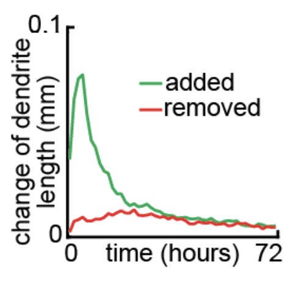

Previously in this series: _[How to build a mind - neuroscience edition](https://kirchner-jan.github.io/minimalprior/posts/universalprior/how-to-build-a-mind-neuroscience?s=w)_ , _[Serendipitous connections: applying explanations from AI to the brain](https://kirchner-jan.github.io/minimalprior/posts/universalprior/serendipitous-connections-applying?s=w)_, _[The Unreasonable Feasibility Of Playing Chess Under The Influence](https://kirchner-jan.github.io/minimalprior/posts/universalprior/the-unreasonable-feasibility-of-playing?s=w)_ , _[A Brief Excursion Into Molecular Neuroscience](https://kirchner-jan.github.io/minimalprior/posts/universalprior/a-brief-excursion-into-molecular?s=w)_.

* * *

##  **Constraints make creative**

Originally, my motivation for getting into neuroscience was: " _Building artificial intelligence is difficult, so perhaps I can learn something from looking at how the biological brain is built. Once I've figured that out, AI will be easy_ ".

(When I read these words I can't help but add a mental "[duuuuh](https://www.youtube.com/watch?v=YClAMYTEuZ0&ab_channel=AmirTolkovsky)".)

Since those innocent days, I have come to appreciate that building a biological brain is a ridiculously [overconstrained problem](https://en.wikipedia.org/wiki/Constraint_satisfaction_problem).

  1. First off - **even before you're done building, the brain must make itself useful**. And it's not just "occasionally helping with an arithmetic problem" - I'm talking about "breathing", "eating", "coordinating limbs"... If the environment is dangerous, then also "running away" or "fighting" is on the menu. And you need to do these things _reliably_ \- lapsing means death.
  1. Second - **every neuron only has access to** _ **local**_ **information**. In particular, every neuron only receives input from a limited number of other neurons (usually < 10,000 out of ~80 billion). From that information, a neuron needs to infer what its role in the developing brain ought to be. Consequently, every solution you come up with must be "symmetric" in the sense that you can swap two neurons, and the end result must still work. ([It turns out the two neurons don't even have to be from the same species](https://www.ncbi.nlm.nih.gov/pmc/articles/PMC6899440/)).
  1. Third - **there is no clear separation between "the thing you're building" and "the thing that is doing the building"[^1]**. [The brain is making itself](https://generative.ink/prophecies/#:~:text=The%20message%20had%20become%20the%20medium) with only rough guidance from genes and the environment (see [this post](https://kirchner-jan.github.io/minimalprior/posts/universalprior/how-to-build-a-mind-neuroscience?s=w) I wrote on the topic a while ago).

In contrast, the solution for AI appears to be (for now) "just stack more layers":

[source](https://www.gwern.net/Scaling-hypothesis#scaling-hypothesis)

In AI, "the thing being built" and "the thing that's doing the building" is cleanly separated into "model" and "optimizer". Global information like the learning rate is readily available to all units. And even _after_ training, there are no predators that punish lack of robustness[^2]. 

But [constraints make creative](https://www.youtube.com/watch?v=v5FL9VTBZzQ&ab_channel=TED-Ed), and it seems like the aforementioned constraints turn out to have their benefits:

  1. First - An adversarial environment forces the brain to be robust against perturbations. Both [theory](https://arxiv.org/abs/1005.2243) and [practice](https://www.deepmind.com/blog/generally-capable-agents-emerge-from-open-ended-play) tell us that with robustness comes the ability to generalize to novel domains. ([Intense adversarial dynamics](https://www.pnas.org/doi/10.1073/pnas.0601428103) might, in fact, explain the [huge gap between monkeys and humans in terms of generality](https://arbital.com/p/agi/#:~:text=that%20distinguishes%20humans%20from%20our%20nearest%20chimpanzee%20relatives).)
  1. Second - A neat consequence of locality is _modularity_. When you try to use as little "wire" as possible to connect your neurons, [locally interconnected modules tend to emerge](https://royalsocietypublishing.org/doi/10.1098/rspb.2012.2863). Beyond making things [slightly more interpretable](https://academic.oup.com/brain/article-abstract/107/1/328/358592?redirectedFrom=PDF), [modularity can also increase some types of robustness](https://www.cambridge.org/core/journals/proceedings-of-the-design-society-design-conference/article/modularity-robustness-and-change-propagation-a-multifaceted-relation/C9650B03547EF5DBA2009910352F3F9F).
  1. Third - ... This one beats me.

What is the benefit of having to build yourself? I'm not sure. Let's zoom in on that.

##  **Bootstrapping brains**

What does it mean for the brain to be building itself?

As the brain is growing, it is _dynamically_ responding to cues. Removing input to one eye and the visual cortex balances the loss by [upregulating input from the other](https://www.pnas.org/doi/abs/10.1073/pnas.1918368117). _Adding_ an additional eye results in... well, this:

The Science editors couldn't resist and tagged this as "[Cultivating the Third Eye](https://www.science.org/doi/10.1126/science.308.5724.948a)"

When the brain does this type of rearranging, it is both the thing that "notices" that something is wrong, and it's also the thing that "is being modified".

Third-eye shenanigans are only one (illustrative) example of the dynamic nature of development. Throughout development, immature neural **circuits** produce **activity** that induces activity-dependent formation/removal of synapses, which changes the **circuit** , which leads to changed **activity** , ... **The circuit is "the thing you're building," and its activity is "the thing that is doing the building"**.

[source](https://kirchner-jan.github.io/minimalprior/posts/universalprior/how-to-build-a-mind-neuroscience?s=w)

I've briefly [written about this dynamic](https://kirchner-jan.github.io/minimalprior/posts/universalprior/how-to-build-a-mind-neuroscience?s=w) before, but now I want to take a deeper dive because a thing I've been working on with colleagues for a while is [finally out as a preprint](https://www.biorxiv.org/content/10.1101/2022.05.24.493217v1).

Let's start by building some intuition by looking at pretty pictures. We start with one of my favorite recordings of the optic tectum of a zebrafish developing over 16 hours:

[source](https://www.nikonsmallworld.com/news/developing-sensory-nervous-system-of-a-zebrafish-wins-2018-nikon-small-world-in-motion-competition)

After soaking in this beauty for a bit, I would like to ask you to look closely at some of the tiny protrusions. You'll notice that the smaller protrusions tend to probe the environment a bit before settling for a direction to grow in.

[Niell and colleagues](https://www.nature.com/articles/nn1191) made that observation eight years earlier, but their camera wasn't as nice.

On the plus side, they got a very close look at an individual dendritic tree of a neuron in the optic tectum. And importantly, they genetically manipulated the fish so that its synapses glow green. So they were able to look closely at the interactions between dendrite growth and synapse formation.

Now, this is where the plot thickens. Synapses are the site of transmission of electric nerve impulses between two nerve cells, so synapses live at the intersection of the **circuit** (defined by the locations of synapses) and its **activity** (the signal transmitted by the synapse). Therefore, we might expect that the dynamics of synapse development should be pretty important.

And that's indeed the conclusion that Niell and colleagues arrive at. They look very closely at a developing branch, and they notice that once a synapse (a green blob) forms, the developing dendrite tends to _anchor_ to that synapse. So it seems that during early development, the initial synapses a dendrite makes can act as a type of _scaffold_.

##  **Probably prunable**

But not all development is about growth! Rather, it's about growth plus **selective pruning**. I've [written](https://kirchner-jan.github.io/minimalprior/posts/universalprior/a-brief-excursion-into-molecular?s=w) about a potential molecular mechanism underlying this dynamic before, and now we'll see it in action.

Right out the gate - even though there can be a lot of pruning, this typically doesn't mean that the dendrite gets _shorter_ in total[^3]. Typically, retractions of branches are balanced by the addition of new branches. Here are pictures from a timelapse from a Xenopus tadpole neuron:

The bottom row shows branches that will be lost by the end of the recording in red, branches that appear and disappear throughout the recording in green, and branches that emerge and are stable until the end of the recording in yellow. Importantly, despite all the local changes, the overall length of the dendrite remains approximately the same.

What determines if a branch stabilizes or gets pruned? It's kind of unclear - but let's collect the evidence.

  1. First, here's a sequence of pictures from the retina of a baby chicken. The pictures show a dendrite in the baseline (left), when activity is blocked (middle), and when activity is allowed again.  

[source](https://www.nature.com/articles/nature00850#Fig3)

The dendrite retracts rapidly when the activity stops and then extends again when the activity resumes. So **dendrite retraction can be triggered by activity-dependent mechanisms**.

  1. Second, here's a dendrite in the optic tectum of the Xenopus tadpole. The tadpole is trained with a visual stimulus, and the dendrite shows new protrusions that form in response to the training. Importantly, these protrusions are responsive to the stimulus that the tadpole was trained with.
[source](https://www.biorxiv.org/content/10.1101/2021.02.11.430646v1.full)

So **specific activity can trigger the growth of dendrites**.

  1. Third, the "[Sherlock and Moriarty of molecular neuroscience](https://kirchner-jan.github.io/minimalprior/posts/universalprior/a-brief-excursion-into-molecular?s=w)" also get a starring role in this story. [In this study](https://molecularbrain.biomedcentral.com/articles/10.1186/1756-6606-2-27#Sec11), researchers incubate rat brain neurons in either BDNF (matBDNF) or proBDNF (CR-proBDNF) and find that the signaling molecules dramatically affect neuronal morphology.

([As perhaps expected](https://kirchner-jan.github.io/minimalprior/posts/universalprior/a-brief-excursion-into-molecular?s=w),) **BDNF increases dendrite length and complexity, while proBDNF leads to almost complete dendrite removal**.

  1. Finally, we had pretty strong intuitions about how synapses ought to interact with each other [from previous work](https://kirchner-jan.github.io/minimalprior/posts/universalprior/a-brief-excursion-into-molecular?s=w). In particular, there's a [bunch](https://www.cell.com/neuron/fulltext/S0896-6273%2815%2900572-3) of [neat](https://www.cell.com/article/S2211-1247%2814%2901045-6/fulltext) experimental [evidence](https://www.science.org/doi/10.1126/science.aao0862) that synapses that fire "out-of-sync" tend to "lose their link". Or, in less poetic terms, **nearby synapses tend to compete**.
Strongly driving the synapses marked in yellow via glutamate uncaging results in shrinkage of the unstimulated synapses marked with the red arrow.

##  **Computerization**

Those were the puzzle pieces we knew about (or [guessed](https://kirchner-jan.github.io/minimalprior/posts/universalprior/on-not-reading-papers?s=w#:~:text=a%20paper%20adds.-,Schematic,-of%20%E2%80%9Cthe%20delta)) when we started the project. It seemed plausible that synapse formation and removal might have a pretty big impact on what the dendrite looks like. And in particular, whether a synapse stabilizes or not might be determined by whether it fires in synchrony with its neighbors.

[When we put these ideas into a model](https://www.biorxiv.org/content/10.1101/2022.05.24.493217v1.full), we get something like the following video:

Initially, the dendrites shoot outwards and search for synaptic connections (synapses not shown in the video). Initially, the dendrite is not picky at all - it just connects with any potential partner it finds. This results in a rapid increase in total length that nicely mirrors the increase in length observed in biology (again from a [Xenopus tadpole](https://oxford.universitypressscholarship.com/view/10.1093/acprof:oso/9780198745273.001.0001/acprof-9780198745273-chapter-3)).

However, now something interesting happens both in the model and in biology; dendrite growth tapers off and stabilizes!

As I've shown you before, this stability in total length does not mean that there is no change in the dendrite structure anymore; rather, the addition and removal of branches are balanced in a **fixed point** /steady state. This is also something we observe in the model:

But why is it that the dendrite "suddenly" stops growing? The answer is unclear from the biological data, but our model gives a neat explanation: Dendrite growth stops because competition between synapses is starting!

Due to the dynamics of the competition, it took a while for synapses to "get to know their neighbors" and decide whether they were well-synchronized. But once they figured it out, synaptic pruning starts, and the dendrite cannot simply add new synapses at random anymore. Thus, growth slows down, and many poorly synchronized synapses get removed. What remains are only well-synchronized synapses:

Color of a synapse here indicates the type of activity that the synapse receives. Same color means that the synapses fire in synchrony, different color means they fire out of sync.

This way, our model can link the development of dendrites and the emergence of synaptic organization in one framework.

[In the paper](https://www.biorxiv.org/content/10.1101/2022.05.24.493217v1), we push things further and show how our model fits in with more experiments and how the resulting dendrites have some cool optimality properties that emerge from a simple synapse-centric growth rule. But for this post, it's time to wrap things up and to return to our original question: How can the brain be, at the same time, "the thing you're building" and "the thing that is doing the building"? And could this be good for anything?

##  **Closing thoughts**

I feel the strong urge to do a bunch of epistemic hedging, "theory is theory and experiment is experiment," and "I could be totally wrong about this", but I think that's [pretty bad style](https://nassimtaleb.org/2016/09/intellectual-yet-idiot/). Instead, I’ll say that this is my current best guess, and if I’m wrong I’ll be appropriately surprised and embarrassed.

Instead of doing more hedging, I’ll stick my neck out even further and talk about “[the delta](https://kirchner-jan.github.io/minimalprior/posts/universalprior/on-not-reading-papers?s=w#:~:text=a%20paper%20adds.-,Schematic,-of%20%E2%80%9Cthe%20delta)”:

 **Schematic** **of “the delta” added by a (typical) academic paper.** Papers you have read before are shown in the background with an orange background. Relationships between papers are indicated with double-sided arrows. The size and shape of the orange background represent the statements you believe are likely to be true. The newly added paper is shown in the foreground on a blue background. The portion that the new paper makes likely to be true (or, sometimes, demonstrates to be true) is “the delta”.

What do I believe now about “the brain that builds itself”?

  1. A straightforward way to obtain structured connectivity in a neural circuit is to start with a _[greedy](https://en.wikipedia.org/wiki/Greedy_algorithm)_[ strategy](https://en.wikipedia.org/wiki/Greedy_algorithm) (connect as many things as possible), followed by an **autoregressive[^4] learning rule that amplifies structure and prunes away the noise**.
  1. Through successive amplification of structure and pruning of noise, **the developmental process converges to a fixed point** , defined as the point where the learning rule produces no more competition.

The “benefit” of this dynamical systems solution is (again) “robustness”. As long as you make sure your learning rule keeps on doing its thing it doesn’t matter if you get small perturbations. You’ll keep rolling towards the valley of attraction anyways.

Sticking my neck out even further, I can’t help but think of the [natural abstraction hypothesis](https://www.lesswrong.com/posts/cy3BhHrGinZCp3LXE/testing-the-natural-abstraction-hypothesis-project-intro) here. Perhaps a lot of the cognitive structure that humans have does _not_ actually require a lot of specification during development. Perhaps the fixed point of the developmental process is “natural” in the sense that any autoregressive learner with sensory input from the world[^5] (and with approximately similar computational capacity) will end up with approximately the same cognitive structure.

This moves the question from the world of neuroscience into the world of… the world? What is the world out there like, and why does it have so much structure? I’ll think about it a bit and update you on my progress ;)

[^1]:This is certainly true _after_ birth, but even in the womb[,](https://nassimtaleb.org/2016/09/intellectual-yet-idiot/) it's not like there is a lot of micro-managing going on.

[^2]:Unless you count the folks at [Redwood Research](https://www.redwoodresearch.org/), of course.

[^3]:This image floating around the internet gets used _all over the place_ to argue that there is something special happening in the brain of humans around the age of 5-6. The image comes originally from [Seeman, 1999](https://ajp.psychiatryonline.org/doi/10.1176/ajp.156.2.168):

It might well be that something special happens at that age, but I cannot find a single other study that replicates the image on the left. In fact, a pretty [credible Nature Review shows](https://www.nature.com/articles/nrn.2018.1#Abs1) an increasing complexity up to age 24.

Also, note that the caption of the Seeman figure talks about a decline in synaptic connections, which are not even visible on the left. And the right shows a decline in dopamine receptors, but with a very suspicious x-axis and very few data points in the most critical period.

[^4]:I think there is a very elegant way in which [Hebbian learning](https://en.wikipedia.org/wiki/Hebbian_theory) can be interpreted as simply doing autoregressive learning. [Sezener et al](https://www.biorxiv.org/content/10.1101/2021.03.10.434756v1.full) are pointing in this direction, and interpreting the [ventral stream as a residual stream](https://kirchner-jan.github.io/minimalprior/posts/universalprior/serendipitous-connections-applying?s=w) fills in some of the blanks.

[^5]:[Or synthetic input shaped by eons of evolution to look like plausible sensory input](https://kirchner-jan.github.io/minimalprior/posts/universalprior/how-to-build-a-mind-neuroscience?s=w).
