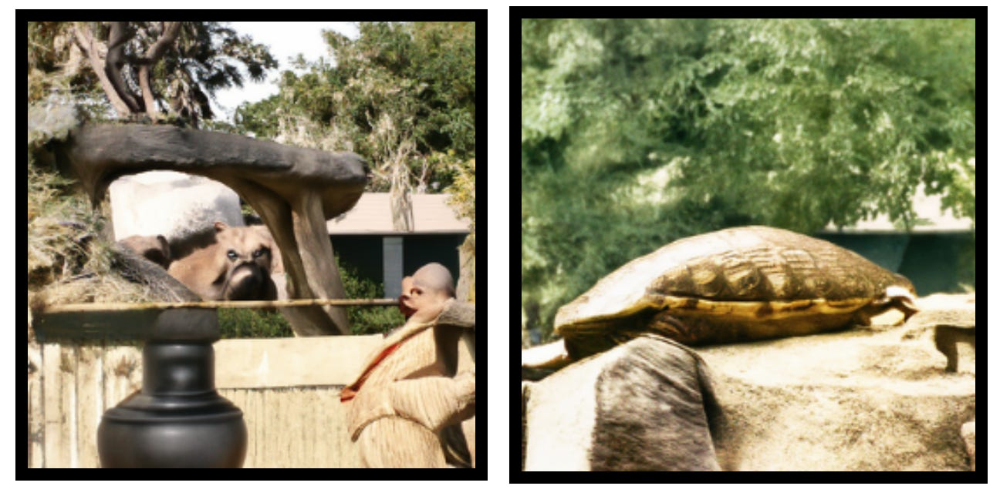
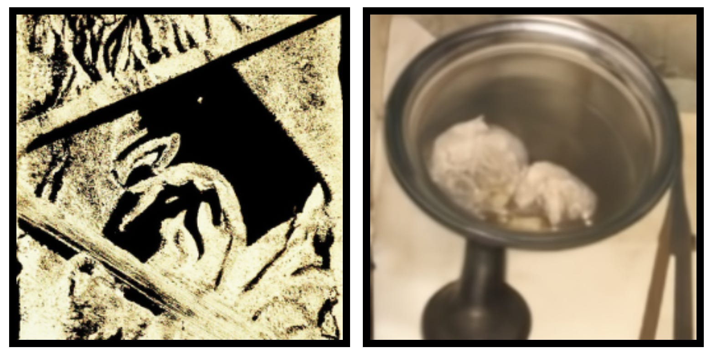
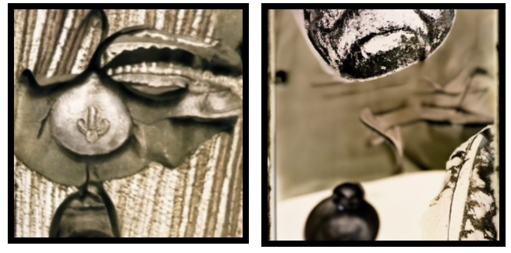

_Co-authored by Nadia Mir-Montazeri and Jan Kirchner._

Meta: This week here is something different! The following story was written for the [EA Creative Writing contest](https://forum.effectivealtruism.org/posts/JFiHewypFB2niuy2G/ea-forum-creative-writing-contest-usd10-000-in-prizes-for). It was inspired by (spoiler alert!) [this](https://www.lesswrong.com/posts/Kbm6QnJv9dgWsPHQP/schelling-fences-on-slippery-slopes#:~:text=The%20Legend%20of%20Murder-Gandhi) thought experiment by Scott Alexander. If you prefer listening to reading, there is an audio version of the story at the top of this post.

* * *

 _"A painting of the devil bargaining with Gandhi.", generated by_ _[CLIP-guided-diffusion](https://huggingface.co/spaces/akhaliq/clip-guided-diffusion)._

* * *

 _It just annoys me, that’s all. Every century or so, one of the squishy ones thinks they are so great and that everybody should love them. A millennia ago, I was able to strike a deal with the big guy and have him send some plagues on a poor soul call Job_[^1]_, murder his family, ravage his land and body... But recently He has not been very cooperative. No, He would not help. Getting rid of the little squishy “saint” would be my own yoke to carry. And I know that’s just what He wanted in the first place. Puffing sulfur from my nostrils, I acquiesce. The squishy thing would suffer for this, oh he would suffer long. But I had to be devious about it, there was my reputation at stake. And I knew just the trick that I could pull on this one…_

* * *

The garden started with a tree, the trunk of a tree. The tree gave birth to a bush, which in turn gave birth to a large area of grass, which in turn gave birth to a beautiful open space, with a pool of water in the middle and surrounded by a large area of grass. One could walk around the perimeter of the space or sit in the middle and enjoy the view. It had always been one of his most favorite places. This is where Mahatma met his students and where they held their council, discussing the world and its people, talking politics, and (to the dismay of more than one of his students) studying the secrets of the world revealed by mathematics. But today was different from the other days. They had an unexpected visitor.

A thick cloud of smoke descended slowly. Mahatma of course knew what it meant, even though this was not part of his religion. But being the goody-two-shoes that he was very aware of being, he carried no ire towards the “other religions”. In fact, having reflected on all of this a long time, he arrived at the conclusion that there was little need for conflict. “An eye for an eye only ends up making the whole world blind.” yada yada yada. This conviction of his would now be tested, being confronted with the literal devil in front of his students and all.

“Mahatma! Cower in fear, mortal. I have come to make you an offer!” “... That sounds like an obvious trap. Your reputation precedes you, Lucifer.” “Really, this fast? What gave me away? The big cloud of sulfur or the thundering voice that makes your bones shiver?" "Really, all of those combined.” Mahatma’s casual tone was contrasted by his intense gaze that followed the devil’s every movement as if he was a snake about to strike. “What's the deal then?" "Ah. It is a deal that comes at a catastrophic cost to you personally. But I believe you might still be inclined to take it.” “So far, not the best pitch I’ve heard this week... Yesterday somebody wanted me to heal their chickens in exchange for their spleen. Explaining to them all the ways in which this was a terrible idea took the better part of the afternoon.”

Mahatma’s students giggled at the joke. The devil ignored this and looked a bit impatient at Mahatma. "Don't look at me like that! _You_ are the one who arrived here... Okay, tell me about your offer." "It is really very straightforward. I shall give you one trillion USD, to use at your own discretion. In exchange, I want you to sacrifice 20% of your goodness."

Mahatma stared in disbelief while he considered this: _Apart from the fact that the USD was not really the dominant currency in India, the deal sounded overwhelmingly good. One trillion USD... With that kind of money, he could do a lot of good_[^2] _. Mahatma had done the research with his students. After saturating charities with funding to fight_ _[against terrible diseases](https://www.givewell.org/charities/malaria-consortium) ,_ _[protect the most vulnerable](https://www.givewell.org/charities/new-incentives)_ _and_ _[give money to the poorest](https://www.givewell.org/charities/new-incentives) , there would still be enough money left to_ _[advocate for those that cannot advocate for themselves](https://animalcharityevaluators.org/)_ _and to put some safeguards in place to_ _[protect this pale blue dot we share](https://www.fhi.ox.ac.uk/). There was a lot of good to be done indeed, he would have to run the exact numbers later. The hardest part would be to make sure that the money doesn’t “disappear in the cracks” and that he would have to make sure that there were no catastrophic side effects. Figuring out exactly how to do the most good would have to be a_ _[community effort](https://www.effectivealtruism.org/) , but there was no doubt in his mind that using the money for good rather than not using it at all was the right decision._

 _In contrast, what was 20% of his goodness? He was at the end of his life anyway, he didn't think he would get another chance to inspire people at as large a scale as he did in his youth. There was his legacy to consider, but he also didn't think that losing 20% of his goodness would make him actively evil. He tried to add up all the good things he might not be able to bring himself to do anymore and all the minor bad things he might end up doing. It all felt like a rounding error in comparison with..._

 _But this was a deal with the devil. This was a trap. He could not see how, but it had to be. As much as it pained him, he could not accept the offer with this little information and reassurance._

"I made a decision..." "Before you decide, you have to know one thing." the devil interrupted. "You have to decide truthfully, according to your best moral assessment. If you decide for what you do not believe to be right and proper, I will know and I shall have your soul for it. Those are the rules of dealing with the devil." "I... never heard about that rule before." The devil again ignored this. Mahatma sighed. And there it was, the trap snapping shut.

"To decide, I need to know: Once I accept the offer, will you leave me alone? Is the money cursed? Will any evil come from you giving me the money? I need to know, otherwise, I cannot decide according to my best moral assessment." The devil grinned... "No." he drawled. "Nothing bad will come from me giving you the money. The money is not cursed. And as soon as we have no more business, I will leave you alone. This, I speak truthfully."

"Then, my hands are tied. I have to answer truthfully, even if it is the answer you clearly desire to hear. But if you'll have my soul in any case, I shall wait a bit longer to see what will be my downfall. I accept the deal."

The devil waved his pitchfork and a dark cloud surrounded Mahatma. Mahatma felt some of his goodness drain out of him. Some of his happy childhood memories became a bit less bright. Some of the inspiring books he read rang a bit less clear in his mind. Some of his resolve to protect what he loved cracked. He became a bit pettier.

The devil took 20% of his goodness.

"Alright, that sucked," Mahatma said and was a bit surprised at the expletive. He did not usually use those in front of his students. Or, really, at all. "I suppose you will not just give me the trillion and leave?" The devil waved his pitchfork again and a large check for 1 trillion dollars with Mahatma’s name as the recipient materialized. "The money is yours. But first..." "Of course" "But first, let me make you another offer."

Mahatma was already dreading the end of this. "Shoot." "You will give me another 20% of your goodness. In exchange, I will add an additional 100 million USD and also turn five randomly chosen people into mass murderers."

Mahatma's mind was racing and doing another [Fermi estimate](https://en.wikipedia.org/wiki/Fermi_problem): _Five mass murders with ~ ten victims on average means 50 people dead. In contrast, 100 million USD can save the lives of... urgh, crap._ He cursed his mind for working fast. But he had already felt it when hearing the deal. He thought it was a good deal. He was not sure he would have thought so before giving up 20% of his goodness, but now the sacrifice felt just about commensurable with 100 million USD.

And in that moment he realized what would happen next. He would have to accept and then there would be another deal and that would be even worse. And eventually, all of his goodness would be gone and he would not be using the money to do anything worthwhile at all. He might even end up donating it to "sweaters for kittens" or something. What would his students think?

The problem was - he actually, deep down, believed that the new deal was good. He could not, in all honesty, say that the deal did not pass his moral bar. He _wanted_ to take the deal. All the color drained from Mahatma's face. The devil's grin became even larger. "I am waiting for your answer, Mahatma. Surely you have already made up your mind, the deal should not be hard to decide on."

There had to be a way out... Suddenly, insight came to him.

 _(Take a bit of time to think about what you would do in Mahatma’s situation!)_

* * *

“Ah, it’s obvious.” “What?” the devil said, the hellish grin slowly sliding from his face. Mahatma waved to one of his students sitting on the bench. “Syneídisi, can you do me a favor? Can you remind me not to accept the next deal the devil is offering me if it is worse than the current one? I’m precommiting now and I’m asking you to be my [accountability buddy](https://en.wikipedia.org/wiki/Accountability_partner).” Syneídisi understood immediately and nodded emphatically.

“You… can’t… just... what?” “I accept your deal, Lucifer. Those that suffer from my decision will haunt me, but it is the best solution I can find.”

The devil waved his pitchfork again, this time with less conviction. Another check materialized as the black mist returned to draw the additional 20% goodness from Mahatma. His view on the world became a bit darker, his love for his students wained, he became somewhat bitter, sarcastic, and detached. _What have I gotten myself into?_ Mahatma thought. _I should not have gotten involved. Why do I always have to get involved?_

A second black mist materialized that was even darker than the one that surrounded Mahatma and its eerie aura radiated “Bad! Stop!”. The mist shot off, splitting into five separate clouds that soon disappeared in the distance.

The devil regained some of his composure. This was the part he enjoyed the most. “See what you have wrought, you _saint_. Five innocent souls will wake up tomorrow with new… urges. They will struggle and squirm, but they will succumb. It might take a while, but eventually, they will succumb, they always do. And you are to blame.” The inner turmoil was visible in Mahatma’s face but he did not object. There would be time to fix this later. First, he had to get rid of the visitor.

“But listen, Mahatma, I have another deal to offer you.” “No chance.” Flames shot up out of nowhere and the devil’s eyes were glowing. “ _Listen_ to me first, mortal. I will give you an additional ten million dollars as well as a private yacht. In exchange, ten additional random mass murderers.” Only a small twitch in Mahatma’s face revealed that he was considering the offer and that he was disgusted by his own conclusion. _I would never actually meet the strangers whose lives I would destroy. And ten million dollars could still do a lot of good, not just for the world, but also for the community that I built with so much care. And the yacht… I know that I am supposed to be above such temptations, but after a life of toiling away for other people, I surely must have earned…_ He shoved the thought away and returned to the situation before him. He turned to his students.

“Syneídisi, what do you think? Should I accept the deal?” Syneídisi simply shook their head. “Then I don’t…” The devil interrupted: “You have to decide according to your _own_ best moral assessment! And I know that you want to take the deal! You can’t just shove the responsibility onto your student!” “Don’t play the fool, Lucifer.” Now it was Mahatma’s voice that took on a threatening tone and whose eyes were piercing. “The game is over, I’ve seen through your trick. You don’t _get_ at all what it means to be good. Yes, calculating is important, but even more important is to leave [room for doubt](https://www.williammacaskill.com/info-moral-uncertainty) in your own judgment! Otherwise, you can convince yourself of everything and nothing! You need friends and a community to grow and to make the hard decisions that you can’t make alone. I trust in the counsel of my students. This is a moral belief that sits even deeper than any desire for a yacht or other short-term temptations. And if my student reminds me of upholding my precommitment, then following their reminder is the moral thing to do. If you had taken more of my goodness I might not have remembered that truth - but I did. And I do. I reject your offer.”

Flames shot again from the ground as the devil burst into a fit of rage, but, screaming murder at the top of his lung, the ground had already begun to open and to pull him downward. Soon there was nothing left except for a stinging smell of sulfur in the air.

Mahatma’s students jumped from their seats and began rushing towards their teacher to congratulate him on escaping the devil’s trick. But Mahatma stopped them, looking grim. “Thank you, everyone. Thank you, Syneídisi. We averted a much darker fate, but today is not a day to celebrate. There are things we have to do. I hope you have learned my lessons well because now you will have to teach me. I’m afraid I have forgotten a lot through this terrible deal…” His voice trailed off. He wanted to ask his students to make some calls to some of his friends and to start planning how to spend the trillion USD the deal had left him with. But he did not trust his own judgment right now. He would have to relearn a lot first.

But there was one wrong thing that he could see clearly and there was little doubt that it required fixing. He had only accepted that five innocent people would slowly turn into mass murderers in exchange for the opportunity to do more good. He did not _want_ them to have this fate.

“I have committed a great evil today by putting five innocent people on track to commit atrocities. But it is not yet too late to undo what I have done. The devil said that the desire to kill will only slowly grow in them. If I can get to them before that, I might be able to avert their fate. I want to leave and find them, while I relearn some of my goodness. In the meantime...” It pained him to say the next sentence, but he trusted his students more than he hated the thought of giving away the money. “I leave the money to you. Follow my teachings in spending it. When I have completed my task, I will return and help you do more good.”

With those words, Mahatma turned away from his gaping students. He had barely made three steps away as Syneídisi caught up to him and started walking beside him. Mahatma smiled.[^3]

* * *

A big thank you to Eleanor, Yagmur, Zhuoshi, Fergus, Leonidas, and all the people from the EA Frankfurt meetup for providing feedback!

[^1]:The Book of Job (/dʒoʊb/; Hebrew: אִיּוֹב‎ – ʾIyyōḇ) addresses the problem of theodicy, meaning why God permits evil in the world, through the experiences of the eponymous protagonist.[^1] Job is a wealthy and God-fearing man with a comfortable life and a large family; God, having asked Satan (Hebrew: הַשָּׂטָן‎ – haśśāṭān, literally "the accuser") for his opinion of Job's piety, decides to take away Job's wealth, family and material comforts, following Satan's accusation that if Job were rendered penniless and without his family, he would turn away from God. [source](https://en.wikipedia.org/wiki/Book_of_Job)

[^2]:Jeffrey Sachs, as one of the world’s leading experts on economic development and the fight against poverty, stated that the cost to end poverty is $175 billion per year for 20 years." [source](https://borgenproject.org/how-much-does-it-cost-to-end-poverty/) [↩︎](https://forum.effectivealtruism.org/posts/FDDm6p5qs32GK9vnx/the-tale-of-gandhi-and-the-devil#fnref-t3Q2KsuNCJLioJc3d-2)

[^3]:One paragraph of the story was completely written by [a “digital person” called #IAN](https://kirchner-jan.github.io/minimalprior/posts/universalprior/making-of-ian). Can you guess which one?
