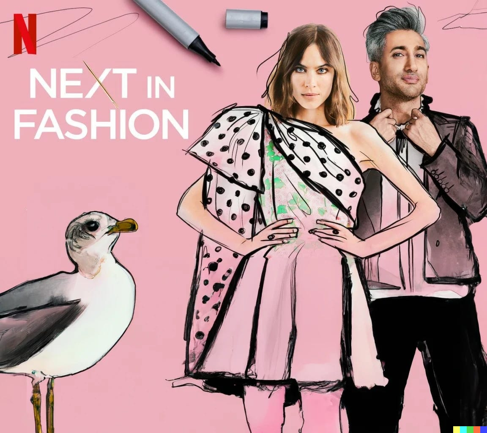
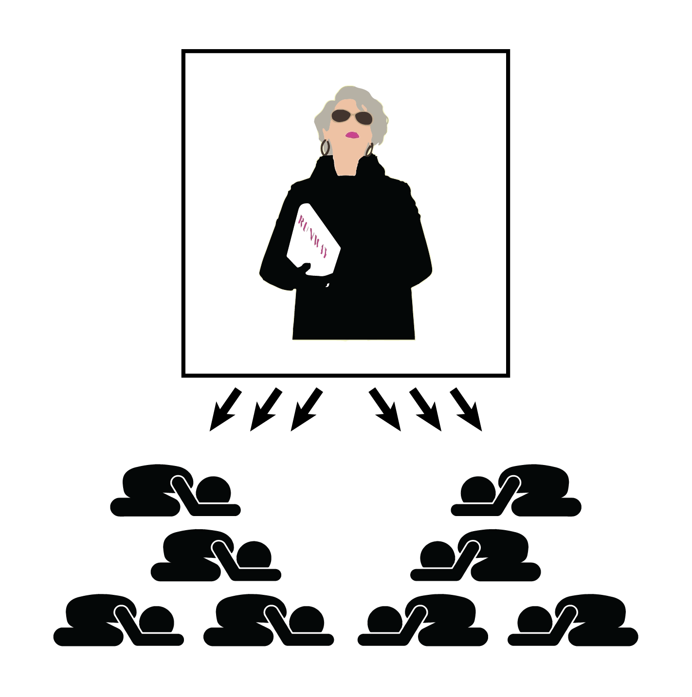
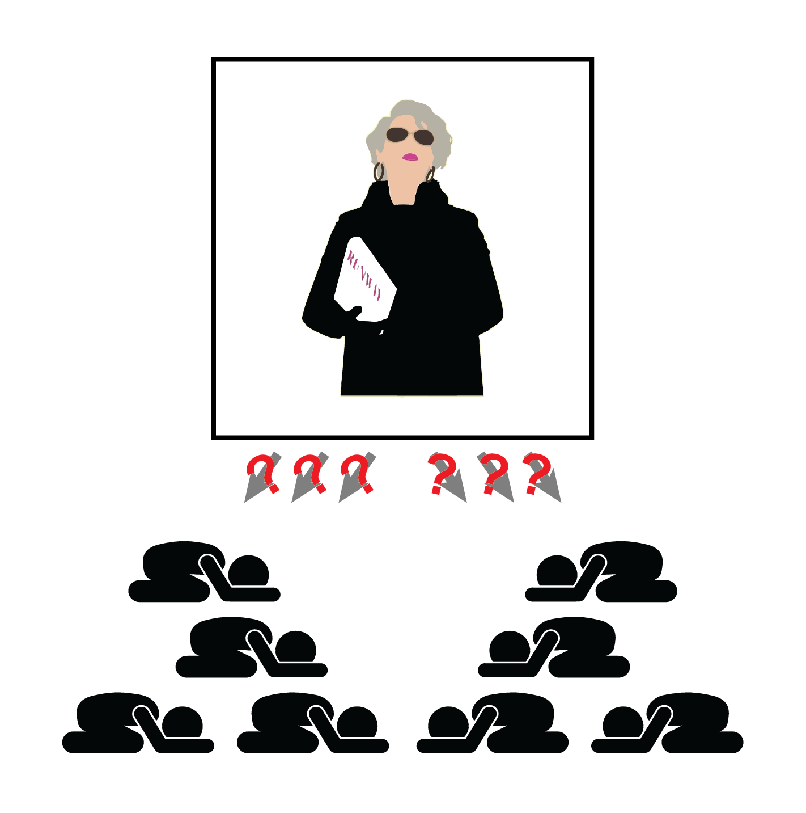
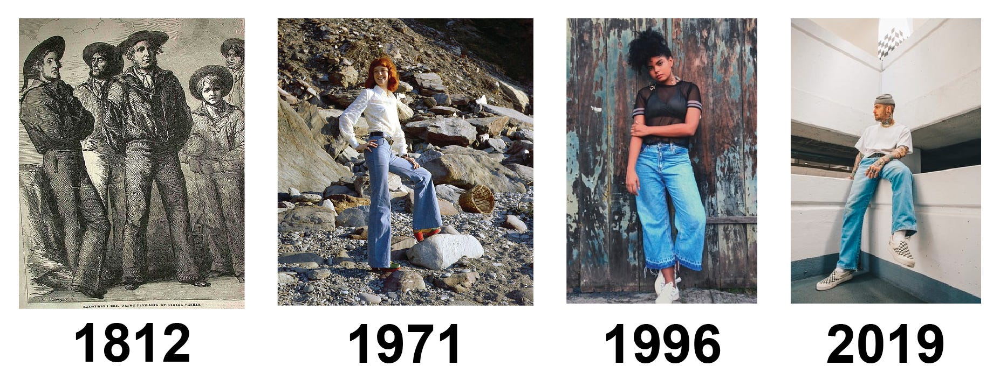
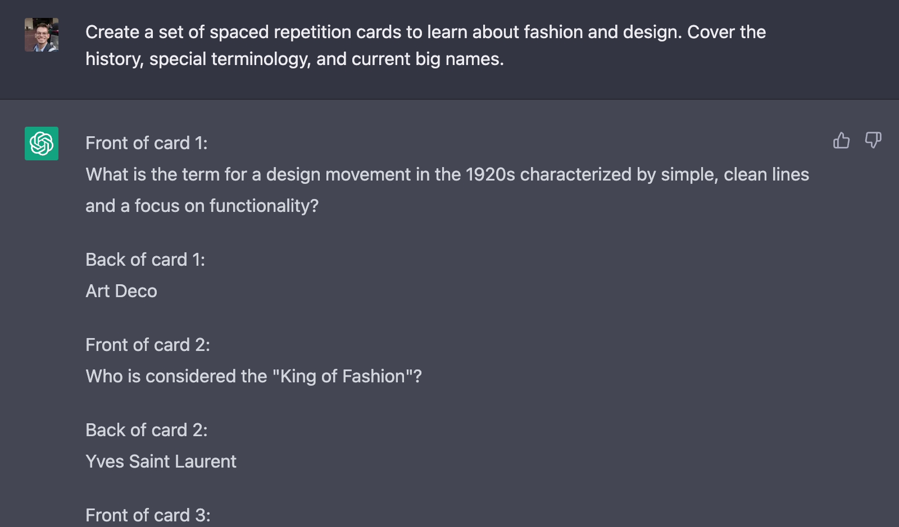
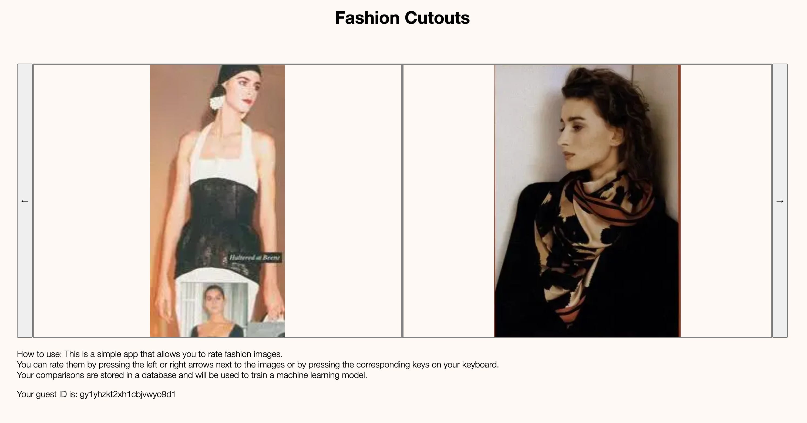

Over the Christmas holiday, I became slightly obsessed with the Netflix show "[Next in Fashion](https://www.netflix.com/title/81026300)." It's (probably) only a temporary obsession, nothing to worry about. But before I move on to the next obsession, I wanted to take a moment to write up what I learned[^1]. 

Buckle up, this will be a weird one.

Before I get into the nitty-gritty of my newfound interest in fashion, let me first address the elephant in the room - why care about fashion in the first place[^2]?

## Why fashion

There are three different schools[^3] of thought on the question.

 _School of the devil_ : The philosophy of "[The Devil Wears Prada](https://en.wikipedia.org/wiki/The_Devil_Wears_Prada_\(film\))[^4]" is centered around the idea that fashion is a form of power and influence. The film explores the idea that the fashion industry is a demanding and competitive field that requires a high level of expertise and commitment, and that subverting the rigid hierarchy of fashion can have unintended or unexpected consequences.

 _School of the barber pole_ : Scott Alexander's [barber pole model](https://slatestarcodex.com/2014/04/22/right-is-the-new-left/) posits that fashion trends move in a predictable cycle, with each new trend allowing elites to distinguish themselves from runner-ups (who take a while to catch up). An important prediction of this model is that fashion worn by the “upper” class can end up looking a lot like fashion worn by the “lower” class, who tend to pick up on trends at a time delay. As such, fashion is primarily a vehicle for signaling social status and group membership.

 _School of reality TV_ : While never spelled out explicitly, in “Next in Fashion” fashion is a form of creative expression and a way to appreciate art. The show centers around the skill and talent required to create unique and innovative designs, and the importance of supporting and nurturing new talent in the industry. In this interpretation, fashion can also help us better understand ourselves, each other, and the world we live in.

## Why I'm not buying it

But none of these explanations are quite satisfying (or even mutually exclusive). Let’s put them under the microscope one by one.

##### Is fashion a form of _power and influence_? 

Let's start with numbers: Global revenue from luxury apparel [comes in at US$82.30bn](https://www.statista.com/outlook/cmo/luxury-goods/luxury-fashion/luxury-apparel/worldwide), which is a so-called [not-insignificant-number](https://kirchner-jan.github.io/minimalprior/posts/universalprior/on-scaling-academia#:~:text=\).%20Those%20are-,not%2Dsmall%20numbers,-%2C%20but%20they%20pale). [Thanks to the bird app](https://fortune.com/2022/12/13/elo-musk-no-longer-world-richest-person-net-worth-drop/), the richest person on earth is now the CEO of the world's largest luxury goods company[^5].

Is that actually a big deal? Whenever I see large numbers, I do my best to put them into perspective:

  * $80 billion is a fair bit more than the [˜US$20bn behind effective altruism charities](https://www.vox.com/future-perfect/2022/8/8/23150496/effective-altruism-sam-bankman-fried-dustin-moskovitz-billionaire-philanthropy-crytocurrency).

  * $80 billion _might_ be enough to finance [Phase I of the California High-Speed Rail system](https://www.wikiwand.com/en/California_High-Speed_Rail#:~:text=cost%20estimates%20to-,complete,-the%20entire%20Phase) or [one of the smaller departments of the state](https://www.usaspending.gov/agency).

  * $80 billion is [0.08% of the global GDP](https://www.statista.com/statistics/268750/global-gross-domestic-product-gdp/) \- do with that information whatever you like.

Fashion moves money, more so today than yesterday. Classic economic theory is not surprised by that fact, as it literally defines luxury goods as those goods for which "[demand increases when a person's wealth or income increases](https://www.investopedia.com/terms/l/luxury-item.asp)". As things [generally-tend-to-get-better](https://en.wikipedia.org/wiki/The_Better_Angels_of_Our_Nature)™, we can expect that (by definition) the amount spent on luxury goods[^6] should continue to increase.

Unfortunately, this "truth by definition" also makes the insight vacuous. My question is exactly _why_ luxury clothing is desirable. [Fashion implies power, not the other way around](https://www.statisticshowto.com/reverse-causality/). What _makes_ a luxury item luxurious?

##### Is fashion all about _signaling_ and the _slow, cyclical propagation of status markers through society's ranks_?

There certainly is some truth to the barber pole phenomenon. When sources as distinct as SlateStarCodex and [CurrentBoutique](https://currentboutique.com/blogs/cravingcurrent/why-do-fashion-trends-come-back) report the same phenomenon, _something_ real is happening. Fashion trends _do_ come back

However - attributing the cyclical features of fashion to [signaling games](https://meltingasphalt.com/social-status-down-the-rabbit-hole/) is… kind of just one possible explanation[^7]? And not even a particularly good one, considering that the bigger part of society doesn't stand in front of their wardrobe thinking about which social class they belong to. The signaling game might still emerge subconsciously (?[^8]), but the CurrentBoutique article comes up with a bunch of alternative explanations that don't require the collaboration of the subliminal. An observation like "TikTokers are raiding their parent's closets" can explain cyclicality while being well-supported by [evidence](https://www.tiktok.com/@greta_rolli/video/6833432906342337798?lang=en). No need for a conspiracy and unspoken signaling games.

Beyond the objection that [signaling games are kind of lame](https://astralcodexten.substack.com/p/book-review-fussell-on-class)[^9], saying "fashion is cyclic" doesn't explain everything there is to explain. Importantly, fashion doesn't _exactly_ repeat, each time around.

From pure function, via tight and then baggy fits, all the way to men-sitting-on-appliances. Superficially similar, but higher-order terms _do_ matter.

While the general cuts of fashion tend to return in some form or other, the details matter a lot! In the words of Balaji, [all progress is along the z-axis](https://twitter.com/balajis/status/1438138118440321032). Bell bottoms keep returning, but _something_ evolves. What is that something? Why do (some) people care?

##### Is fashion about creative self-expression and art appreciation?

This theory is actually correct. I think ‘fashion can help us better understand ourselves, each other, and the world we live in’ is the true answer. People tend to buy pretty things that are valuable to them and they fit into the big tapestry of everything.

I acknowledge that position is not obviously true without further argument. “Next in fashion” is perfectly positioned to explore this topic, presenting us with a team of designers bubbling over with passion and ambition and a total runtime of 500 minutes[^10]. I would love to recommend to you to binge it to learn how fashion sits at the core of everything.

But it falls short of its potential[^11]. Don’t get me wrong, the show is entertaining, jam-packed with drama and emotion, and a lot of pretty designs to look at for ~5 seconds each. But the show does not manage to penetrate the core of what draws us to pretty things. It only shows us that some people very clearly _are_ drawn to it.

I give it 3/5 Jans.

## What I did about it

So now we find ourselves at the center of my holiday obsession.

Text within this block will maintain its original spacing when published
    
    
    What makes things pretty? How do people make pretty things?

There is [more](https://iep.utm.edu/empirical-aesthetics/) [than](https://en.wikipedia.org/wiki/Aesthetics) [one](https://en.wikipedia.org/wiki/Cosmetology) field of academic research that is concerned with that question, but I feel like this type of question must be approached through experiment, not theory. So I aimed to fully submerge myself in the subject matter.

  1. First, I read and watched everything that sparked my interest. The [McQueen documentary](https://www.imdb.com/title/tt6510332/) was revelatory, [Bliss Foster](https://www.youtube.com/@BlissFoster/videos) on YouTube makes insightful short video essays, and [The September Issue](https://www.imdb.com/title/tt1331025/) gives a more nuanced picture of the fashion industry than “The Devil Wears Prada”.
Why is there a chicken in this image you ask? [Oh, you poor imbecile](https://kirchner-jan.github.io/minimalprior/posts/universalprior/soldiers-scouts-and-albatrosses).

  1. Second, I studied as I’d study for a test. I’m a big fan of [spaced repetition](https://www.gwern.net/Spaced-repetition) [in Roam Research](https://thinkstack.club/an-introduction-to-roams-delta-function-spaced-repetition/) and create new cards for my system at a whim. A single repetition can improve recall [dramatically](https://www.gwern.net/Spaced-repetition#:~:text=is%20much%20superior%3A-,Wired,-\(original%2C%20Wozniak%3F\)%3B%20massed), and - check that out! - it turns out language models are really good at creating spaced repetition cards for you. In my experience, [learning about the people and movements](https://kirchner-jan.github.io/minimalprior/posts/universalprior/on-context-and-people) in a field can explain a ton of variability.

  1. I had someone quiz me. Language models are very good at that too, but if push comes to shove a fellow human also does the trick. You can even quiz them back.
I apologize for calling you an imbecile just a moment ago, dear reader. [I apologize](https://xkcd.com/1053/). It’s just - it’s an albatross, not a chicken. Kind of a sore spot for me.

## The Mechanical Anna Wintour

Despite laboring away for multiple **days** I still felt insecure about my ability to distinguish good from bad fashion. I _do_ however feel rather secure about my ability to [train a neural network to learn human preferences](https://kirchner-jan.github.io/minimalprior/posts/universalprior/inferring-utility-functions?utm_source=substack&utm_campaign=post_embed&utm_medium=web). So I threw the experiment strategy out the window, obtained a full scrape of the [Vogue Archive](https://archive.vogue.com/), performed object detection to get cutouts of all the outfits, and embedded the cutouts in a semantic vector space with [CLIP](https://huggingface.co/docs/transformers/model_doc/clip).

Some kids cut out their favorite outfits from magazines they bought with their lunch money, other kids scrape the vogue archive to get cutouts of all outfits since 1892. You say potato, I say tomato. (I stole that joke from a student of mine).

I then recycled code from [an old project](https://kirchner-jan.github.io/minimalprior/posts/universalprior/inferring-utility-functions?utm_source=substack&utm_campaign=post_embed&utm_medium=web) and set up a small interface for making judgment calls and storing them in a [database](https://redis.io/).

After ~~forcing~~ kindly asking[^12] my significant other to make a measly 1000 comparisons[^13], I threw the comparisons into a neural network and trained a reward model. I then ranked the entire dataset and create a montage of the top 15 images.

The reward model clearly learned _something_.

I am happy to report that she thinks the resulting montage captured her taste pretty well[^14]. So I tried to get her to rate 20k additional images, but somehow her enthusiasm for that project diminished quite quickly.

I, however, am not done with this project! The small toy example above demonstrates that fashion sense is not something [unquantifiable](https://putanumonit.com/), but we are still only barely scratching the surface. What is the [shape of the fashion landscape](https://kirchner-jan.github.io/minimalprior/posts/universalprior/a-brief-excursion-into-molecular#:~:text=published%20on%20biorxiv%3A-,Zoom,-in%20on%20the)? Can we predict fashion trends? How variable is fashion taste across people, and how much of that variability can we [explain away](https://en.wikipedia.org/wiki/Conditional_dependence)?

So I made the website public for you all to try:

<https://www.fashionator.xyz/>

All your rankings are stored in a database, so I’ll be able to do some fantastic data analysis soon. If you enter your email address, I might send you your top 15 images. And maybe a follow-up survey. Eventually, with sufficient data, I might be able to get to the bottom of what makes beautiful things beautiful. And then, perhaps, I could install a camera in the closet and help me pick my outfits…

## Closing words

The holidays have been over for a while, but the finishing touches on this project ended up taking a while. That’s a bummer because I would love to dive deeper into the world of fashion. Knocking out the fashionator app was a ton of fun, and there are so many things I’d like to implement:

  * integrating a feed of design and fashion pictures, curated by the trained reward model,

  * guide an image diffusion model with the reward model to generate maximally aesthetic personalized images,

  * or integrate a search engine to find fashion items similar to those in the user’s closet.

Really, this could keep someone busy for the better part of a work week.

On a more serious note, though, my excursion has not only uncovered wonders and beautiful things. The more cynical take from above (linking the world of fashion with power hierarchies and social signaling) still accurately describes one aspect of the truth. Obsession with fashion also produces a lot of things that are [kind](https://en.wikipedia.org/wiki/Fast_fashion) [of](https://www.investopedia.com/articles/personal-finance/091115/psychology-behind-why-people-buy-luxury-goods.asp) [ugly](https://www.forbes.com/sites/syamameagher/2020/02/05/the-not-so-hidden-ethical-cost-of-fast-fashion-sneaky-sweatshops-in-our-own-backyard/?sh=58031e7325d1).

I maintain that power and signaling are _downstream_ of what makes fashion desirable[^15], but that doesn’t make those [ugly inadequacies](https://equilibriabook.com/) not exist. Fashion is entangled with power, money, and fame; and thus inaccessible to anyone who doesn’t spend [unreasonable](https://www.givewell.org/cost-to-save-a-life#:~:text=save%20a%20life%E2%80%94-,about,-%244%2C500%20on%20average) amounts of time and money.

There is a [possible future](https://futureoflife.org/project/worldbuilding-competition/) where [everything](https://kirchner-jan.github.io/minimalprior/posts/universalprior/a-quick-one-while-hes-away) goes well. In that world, we might need to think about what humans really _want_. The thing at the core of fashion, stripped from power-play and signaling games, feels like it could be part of that[^16]. Getting a bit closer to that _thing_ made the entire excursion more than worth it for me.

* * *

I hope you enjoyed this excursion! I’ll probably return to writing about AI Alignment for the next post - or [whatever else captures my attention](https://slatestarcodex.com/2014/05/25/apologia-pro-vita-sua/). If you want to follow along and haven’t yet, consider subscribing!

[^1]:in the blogging space as writing about [Infrabayesianism](https://kirchner-jan.github.io/minimalprior/posts/universalprior/elementary-infra-bayesianism).

[^2]:Isn't the whole point of moving to the Bay so that you _don't_ have to care about what you are wearing?

[^3]:That I had the patience to spell out

[^4]:alright, perhaps my obsession was not limited to a Netflix show

[^5]:with luxury clothing [producing the largest share of the revenue](https://r.lvmh-static.com/uploads/2022/07/lvmh_interim-financial-report-2022.pdf)

[^6]:Whatever that might mean in the future.

[^7]:Scott probably wouldn’t object. His B-plot with the [cellular automata](https://slatestarcodex.com/2014/04/22/right-is-the-new-left/) and the fashion is just a set-up for writing about politics - something I will never do! So there’s no territorial dispute here.

[^8]:I’m not even sure what [consciousness is supposed to mean](https://kirchner-jan.github.io/minimalprior/posts/universalprior/frankfurt-declaration-on-the-cambridge?utm_source=substack&utm_campaign=post_embed&utm_medium=web), the [unconscious](https://en.wikipedia.org/wiki/Unconscious_mind) is certainly above my paygrade.

[^9]:See, Scott is not above poking fun at the intrinsic cringiness of signaling games.

[^10]:That’s more than 8 hours!

[^11]:So instead I recommend watching it as pleasant entertainment!

[^12]:Her taste is by far more refined than mine!

[^13]:Time flies when you are having fun.

[^14]:“Not a color to be seen”

[^15]:The most sought-after designs are sought after not ( _only_ ) because they communicate power, money, and fame, but also because these designs capture something deep about what we as humans care about.

[^16]:Remember the definition from economics!
